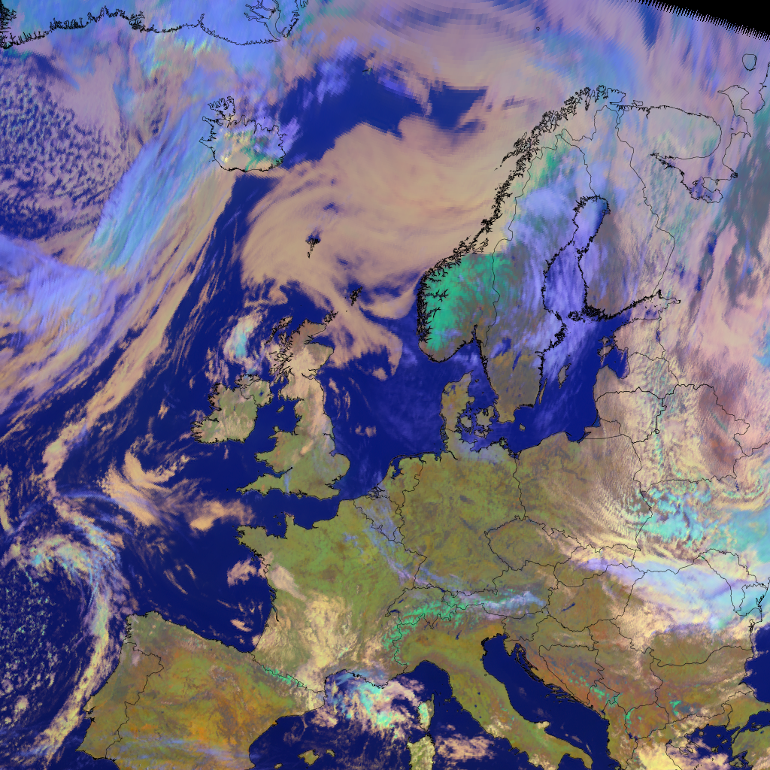
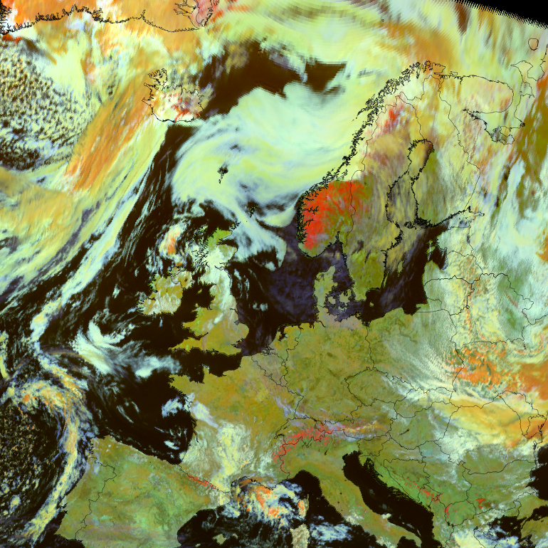
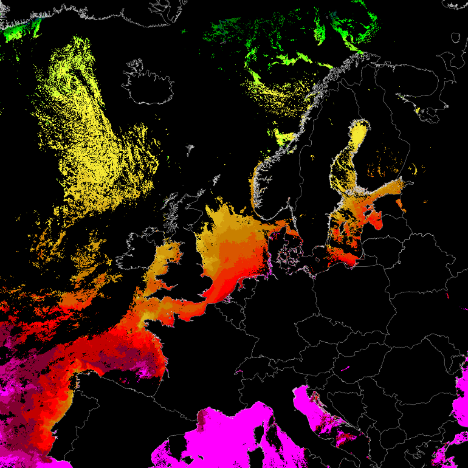
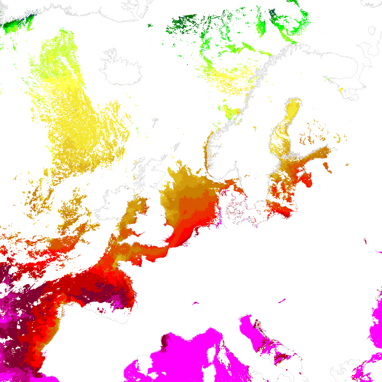

.. -*- coding: utf-8 -*-

.. meta::
   :description: Pytroll image and code gallery of examples
   :keywords: Meteosat, SEVIRI, AVHRR, Metop, NOAA, MODIS, Terra, Aqua, VIIRS,
   Suomi-NPP, NPP, JPSS, SDR, AAPP, CSPP, HRPT, TerraSAR-X, COSMO-SkyMed,
   Radarsat-2, Himawari, Sentinel, SLSTR, OLCI, Sentinel-1, Sentinel-2,
   Sentinel-3, GOES-R, ABI, GOES-16, read, reading, reader, process,
   processing, python, pytroll, weather, satellite, data, image, code

========
 Gallery
========

Click on the images below to get full scale image and code.

.. figure:: images/myoverview.png
   :alt: SEVIRI overview RGB
   :target: `seviri_code1`_
   :scale: 20%
   :align: left

   SEVIRI RGB *overview* - mpop

.. figure:: images/mynaturalcolors.png
   :alt: SEVIRI natural color RGB
   :target: `seviri_code2`_
   :scale: 20%
   :align: left

   SEVIRI RGB *natural colors* - mpop

.. figure:: images/ch6.png
   :alt: SEVIRI natural color RGB
   :target: `seviri_code3`_
   :scale: 20%
   :align: left

   SEVIRI single channel image - mpop

   Reproject SEVIRI data and add coastlines - mpop

   Special RGB using the derived 3.9 micron reflectance with *pyspectral* - mpop

   OSISAF SSTs from Suomi-NPP with color scale and coastlines - mpop

   OSISAF SSTs from Suomi-NPP with color scale and coastlines - satpy

.. figure:: images/metopa_iasi_ctp_euro4.png
   :alt: 
   :target: `iasi_ctp_code1`_
   :scale: 20%
   :align: left

   Decode BUFR containing Metop IASI CTP data and resample/plot - trollbufr

.. _seviri_code1: seviri_example1.html
.. _seviri_code2: seviri_example2.html
.. _seviri_code3: seviri_example3.html
.. _seviri_code4: seviri_example4.html
.. _seviri_code5: seviri_example5.html
.. _osisaf_sst_code6: osisaf_sst_example6.html
.. _osisaf_sst_code7: osisaf_sst_example7.html
.. _iasi_ctp_code1: trollbufr_iasi_ctp.html
