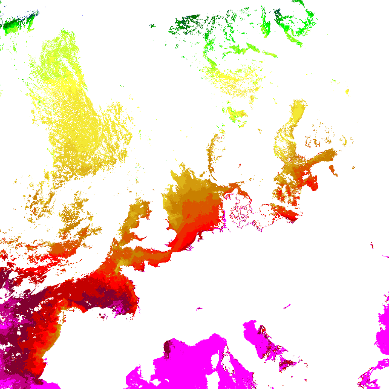

VIIRS OSISAF SSTs using *satpy*
===============================

satpy_ is the new and coming replacement of mpop_. It is still in an
alpha-version kind of state, but it already provides some basic functionality
as well as support for several satellite sensors. Development and enhancements
of mpop_ is now frozen, so support for new sensors and datatypes are likely to
only be available via satpy_. Here an example reading and displaying OSISAF
SSTs, corresponding to the example given in :doc:`osisaf_sst_example6` for
mpop_. 

One of the improvements of satpy_ over mpop_ is that most things can be
done with the builtin default configuration:

   >>> from satpy.scene import Scene
   >>> scn = Scene(
           sensor='viirs',
           satid='NPP',
           filenames=[
               "/home/a000680/data/osisaf/S-OSI_-FRA_-NPP_-NARSST_FIELD-201609081300Z.nc"],
           reader='ghrsst_osisaf'
       )

!NB: The path to the netCDF file above of course needs to be adapted to your needs.

    >>> scn.load(['sea_surface_temperature'])
    >>> lcd = scn.resample('euro4', radius_of_influence=2000)
    >>> sstdata = lcd['sea_surface_temperature'][:]
    >>> import numpy as np
    >>> arr = np.ma.where(np.less_equal(sstdata, 0), 0, sstdata - 273.15)

Convert sst to numbers between 0 and 28, corresponding to the lut:

    >>> data = np.ma.where(np.less(arr, 0), 28, 28.0 - arr)
    >>> data = np.ma.where(np.greater(arr, 23.0), 4, data).round().astype('uint8')

Imagery with *trollimage*
-------------------------

Use trollimage_ to make an image out of the data:

    >>> from trollimage.image import Image
    >>> from satpy.imageo import palettes
    >>> palette = palettes.sstlut_osisaf_metno()
    >>> img = Image(data, mode='P', palette=palette)
    >>> img.show()

Coastlines with *pycoast*
-------------------------

Now, add coastlines with pycoast_ (set the path so it points to where the pycoast shape files are stored):

    >>> from pycoast import ContourWriter
    >>> cw_ = ContourWriter('/home/a000680/data/shapes')
    >>> pilim = img.pil_image()
    >>> area_def = lcd['sea_surface_temperature'].info['area']
    >>> cw_.add_coastlines(pilim, area_def, resolution='i', level=1, outline=(220, 220, 220))
    >>> pilim.show()

.. image:: images/osisaf_sst_viirs_satpy_withovl.png

.. _mpop: http://www.github.com/pytroll/mpop
.. _satpy: http://www.github.com/pytroll/satpy
.. _pycoast: http://www.github.com/pytroll/pycoast
.. _trollimage: http://www.github.com/pytroll/trollimage

