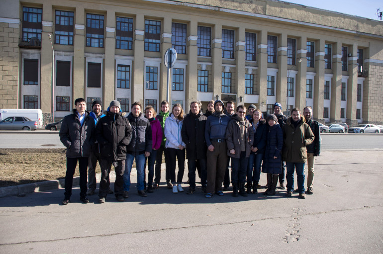
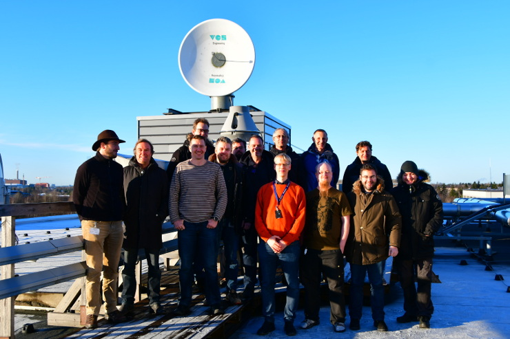
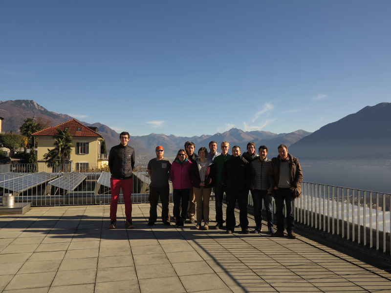
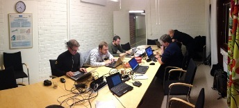
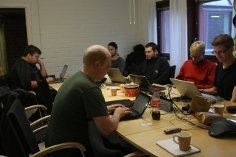
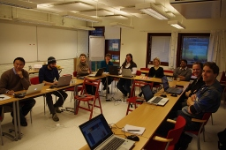
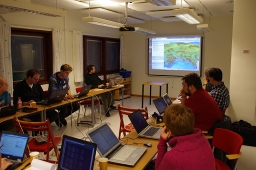

=========
Workshops
=========

RSHU, Saint Petersburg, Russia, March 2017
==========================================

          +-------------+
          |   |pict|    |
          +-------------+
          | |figtxt|    |
          +-------------+

.. |figtxt| replace:: 

   A pytroll developers workshop was held at the Russian State
   Hydrometeorological University (RSHU) in Saint Petersburg, Russia, between
   March 27th and 31st, 2017. We were around 20 participants from various
   National Meteorological Institutes, universities and companies.

   

FMI, Helsinki Finland, November 2016
====================================

          +-------------+
          |   |pict|    |
          +-------------+
          | |figtxt|    |
          +-------------+

.. |figtxt| replace:: 

   A pytroll developers workshop was held at the Finnish Meteorological
   Institute (FMI) in Helsinki between November 28th and December
   2nd, 2016. We were 14 developers from various National
   Meteorological Institutes and companies around Europe.

DWD, Offenbach Germany, June 2016
=================================

          +--------------+
          |   |pict3|    |
          +--------------+
          | |figtxt3|    |
          +--------------+

.. |pict3| image:: _static/Group2_small.JPG
    :width: 740px

.. |figtxt3| replace:: 

   A pytroll developers workshop was held at the Head Quarters of Deutscher
   Wetterdienst (DWD) in Offenbach between June 13 and 17, 2016. With the
   paticipation of 18 developers from the national Met Services of Switzerland,
   Norway, Denmark, Sweden, Finland and Germany, as well as EUMETSAT it was the
   largest to date.

MeteoSwiss, Locarno Switzerland, Dec 2015
=========================================

             +--------------+
             |   |pict0|    |
             +--------------+
             | |figtxt0|    |
             +--------------+

.. |figtxt0| replace:: 
   Pytroll workshop Locarno 2015

Workshop 2013, November, Norrköping
===================================

  +---------+------------+
  | |pict1| |    |pict2| |
  +---------+------------+
  |   |figtxt1|          |
  +----------------------+

.. |figtxt1| replace:: 
   After a two day open workshop we were 7 pytrollers from Finland, Iceland and
   Sweden staying till the end of week working together on some pressing
   issues. See below for a summary of achievements.  If you would like to
   contribute actively with the pytroll development, please let us know at the
   mailing list (pytroll@googlegroups.com) or chat with us directly on the
   pytroll slack: https://pytrollslackin.herokuapp.com/. We plan to have
   two pytroll weeks (usually 4-5 days of dedicated programming) each
   year. Usually we will identifiy a few specific topics that we think needs
   special attention.

Summary achievements
--------------------

 * Extending the user community: Several new users have become more familiar
   with Pytroll and started contributing.

 * Testing: A number of bugs and user inconveniences were identified, and some
   have been solved already.
 
 * Enhancements to Pyresample:

   * Now Pyresample allows to attach a weight to the gaussian reprojection
     method. This is convenient when e.g. gridding several swath products into
     a level 2.5/3 product (Climate applications).

 * MIPP enhancements and user documentation: MIPP allows XRIT decompression on
   the fly, and MIPP documentation slightly improved.

 * Three new projects initiated:

   * Pydecorate to add logos, text, color bars and stuff to images
   * Trollimage - an enhancement of the image.py module in mpop including some
     color enhancements. Will deprecate image.py in mpop
   * Trollduction - A modular batch production framework for Pytroll

 * netCDF reader for SSM/I

 * Trollcast testing, for data exchange between SMHI and FMI - resolution is
   pending (time outs)

 * Designing and developing the FMI Pytroll based polar production
   system. Probably resulting in a general concept that can be useful to
   other users

 * Looking at how to enable web based batch production monitoring with
   Pytroll. Could e.g. be used for an easy and quick access to Pytroll products
   for in-house R&D

 * Initiated an overhaul and check of the EUMETSAT recipe RGBs in Pytroll and
   how they compare and deviate with the official ones. Done in collaboration
   with the Romanian Met Service.

 * Colorizing Pytroll images (using the new trollimage component) -
   ''sandwich'' product. Color enhanced imagery is commonly used in forecast
   offices, e.g. IR imagery with cold temperatures enhanced using a color
   palette.

Presentations at the workshop
-----------------------------

Watch all the presentations on youtube_ !

* `Pytroll history`_
* `Rationale and motives`_
* Pyresample_
* Mpop_
* Mipp_
* Pyorbital_
* Python-bufr_
* Pycoast_
* Geotiepoints_
* Posttroll_
* Trollcast_
* Pyspectral_
* `Other pytroll projects`_
* Tools_

Workshop 2012
=============

The first open Pytroll workshop was held in Norrköping, Sweden, end of
November, 2012. Nine programmers or satellite experts from Holland, Finland,
Romania and EUMETSAT joined up with the pytroll teams at DMI and SMHI, to get
more acquainted with the pytroll tools and how it can be used in their local
environments for satellite data production.

  +---------+---------+--------------+
  | |pictA| | |pictB| | |figtxt2|    |
  +---------+---------+--------------+

.. |figtxt2| replace:: Hard work at the 2012 workshop in Norrköping, Sweden.

Presentations at the workshop
-----------------------------

* `Rationale and motives`_
* Pyresample_
* Mpop_
* Mipp_
* Pyorbital_
* Python-bufr_
* Pycoast_
* Geotiepoints_
* Posttroll_
* Trollcast_
* `Other pytroll projects`_
* Tools_

.. _`Rationale and motives`: https://docs.google.com/presentation/d/1dLv5m56ETmr21HsjPTI_N5Ix-2zguUN2-5wKPZ0Z6Fk/edit
.. _Pyresample: https://docs.google.com/presentation/d/1rkM-5HNqn0Wj5BlIQVFvyzCMYfS_DfnG-zw4OuzrRzU/edit
.. _Mpop: https://docs.google.com/presentation/d/1drrlj97iNlETq-WNeUJF_01FWDuERyvWRJVTmg1_dd0/edit 
.. _Mipp: https://docs.google.com/presentation/d/11077fLfpjWmJUi8mfGWeT7awXSeRF82jnFcIEDUFCZI/edit
.. _Pyorbital: https://docs.google.com/presentation/d/10ZDJ8MiHu5-gpSAOUctvhVTxyqJn3VO8zJNSA2TGjKo/edit
.. _Python-bufr: https://docs.google.com/presentation/d/166xxfcCW072YuHmz-u5C0CP559HUuH5lOYmQErdOjCU/edit
.. _Pycoast: https://docs.google.com/presentation/d/1c9zrXutazOs8rXhItEiUlWb5K_lBhewHAlrnzmYxoBw/edit
.. _Geotiepoints: https://docs.google.com/presentation/d/1AhdZhgOLlbHHNAAEQv1JflFTmPTV3ziOQLhBF2jQWr8/edit
.. _Posttroll: https://docs.google.com/presentation/d/18emgrIlTxdz-r-c5UrG6M5Y2QQyJ70g34wKbhWFFsjM/edit
.. _Trollcast: https://docs.google.com/presentation/d/1I7q6kgm4K2pEL8QP0SJkGsHDH5f3UHnDYe5GCA9NB_g/edit
.. _`Other pytroll projects`: https://docs.google.com/presentation/d/1RL9nr2pvo9vG-WaNtckhRJWdO4bLBSPC53nYc3g3mjQ/edit
.. _Tools: https://docs.google.com/presentation/d/1AMZt0jBMYem8g7tbNOvz9MEWRm-DbwNCBv9KJPA32cE/edit

.. _youtube: http://www.youtube.com/watch?v=WEk95gxO8sE
.. _`Pytroll history`: https://docs.google.com/presentation/d/1vrtn0kNEWPQE02sZmQwqSfk1Ax3NO9BW5sRZ8mN-x6w/edit
.. _`Rationale and motives`: https://docs.google.com/presentation/d/1dLv5m56ETmr21HsjPTI_N5Ix-2zguUN2-5wKPZ0Z6Fk/edit
.. _Pyresample: https://docs.google.com/presentation/d/1rkM-5HNqn0Wj5BlIQVFvyzCMYfS_DfnG-zw4OuzrRzU/edit
.. _Mpop: https://docs.google.com/presentation/d/1drrlj97iNlETq-WNeUJF_01FWDuERyvWRJVTmg1_dd0/edit 
.. _Mipp: https://docs.google.com/presentation/d/11077fLfpjWmJUi8mfGWeT7awXSeRF82jnFcIEDUFCZI/edit
.. _Pyorbital: https://docs.google.com/presentation/d/10ZDJ8MiHu5-gpSAOUctvhVTxyqJn3VO8zJNSA2TGjKo/edit
.. _Python-bufr: https://docs.google.com/presentation/d/166xxfcCW072YuHmz-u5C0CP559HUuH5lOYmQErdOjCU/edit
.. _Pycoast: https://docs.google.com/presentation/d/1c9zrXutazOs8rXhItEiUlWb5K_lBhewHAlrnzmYxoBw/edit
.. _Geotiepoints: https://docs.google.com/presentation/d/1AhdZhgOLlbHHNAAEQv1JflFTmPTV3ziOQLhBF2jQWr8/edit
.. _Posttroll: https://docs.google.com/presentation/d/18emgrIlTxdz-r-c5UrG6M5Y2QQyJ70g34wKbhWFFsjM/edit
.. _Trollcast: https://docs.google.com/presentation/d/1I7q6kgm4K2pEL8QP0SJkGsHDH5f3UHnDYe5GCA9NB_g/edit
.. _Pyspectral: https://docs.google.com/presentation/d/1Re076BDSrzodiPS9fvLZOZdWWejJ7jqo3BqGl_xicp4/edit
.. _`Other pytroll projects`: https://docs.google.com/presentation/d/1RL9nr2pvo9vG-WaNtckhRJWdO4bLBSPC53nYc3g3mjQ/edit
.. _Tools: https://docs.google.com/presentation/d/1AMZt0jBMYem8g7tbNOvz9MEWRm-DbwNCBv9KJPA32cE/edit
