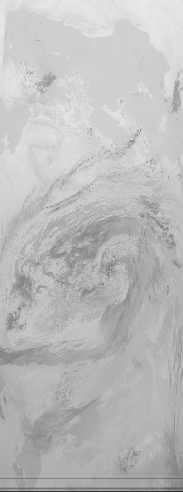
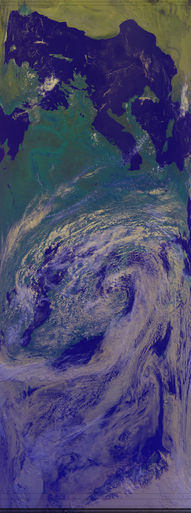
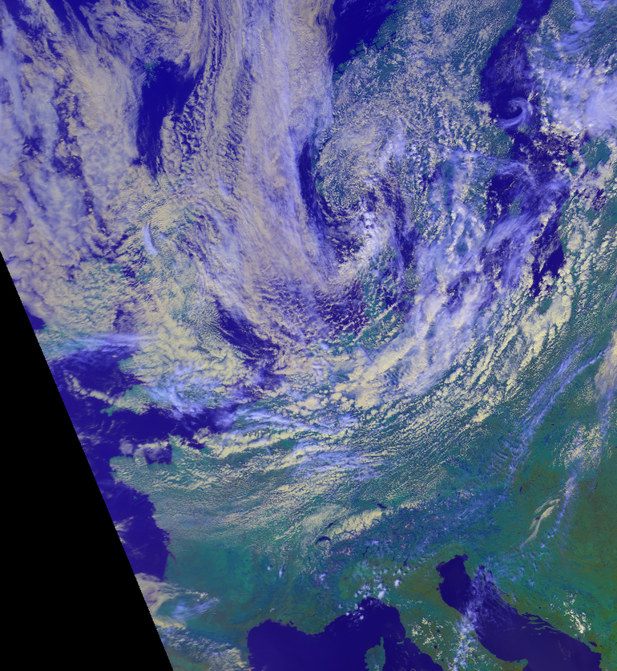
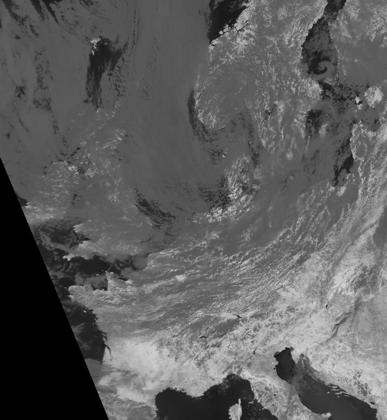

======================
 Quickstart with AVHRR
======================
For this tutorial, we will use AVHRR HRPT data in the level1b format produced by AAPP_, read into
mpop_, resample it with pyresample_ and process it a bit. Install theses packages first.

For this tutorial template config files (see :doc:`install`) can be used. These are located in the *etc* dir of the mpop_ source. Copy *mpop.cfg.template*, *areas.def.template* and *noaa19.cfg.template* to another dir and remove the *.template* extension. In the config file *noaa19.cfg* locate the section :attr:`avhrr-level2` and modify the defined :attr:`dir` to point to the dir of your level1b AVHRR data.

Making mpop read level1b AVHRR
==============================
mpop reads level1b AVHRR using a plugin based on AHAMAP. `Download the latest patched version of AHAMAP here`_. 

AHAMAP is a parts of EUMETSAT's `NWC SAF`_ PPS package. The full PPS package with license can be obtained from the `NWC SAF homepage`_.

Unpack the AHAMAP tarball. In order to make AHAMAP build numpy_ and the proj4_ library and proj4_ development files must be installed on the system. Assuming standard install directories for proj4_ configure AHAMAP like this:

.. code-block:: bash

    $> ./configure --prefix=/some/where --with-proj=/usr/include,/usr/lib --with-python=yes 
       --without-aapp --with-numpy=/usr/lib/python2.6/dist-packages/numpy/core/include/numpy
    
Adapt the specified paths to match your system.

Build, check and install AHAMAP:

.. code-block:: bash

    $> make
    $> make check
    $> make install 

Now add */some/where/lib* to your PYTHONPATH. E.g.:

.. code-block:: bash

    $> export PYTHONPATH=$PYTHONPATH:/some/where/lib
    
First example: Loading data
===========================
This example assumes AAPP level1b data from NOAA19 with the timestamp 29/8-2011 11:40 orbit 13173 exists in the :attr:`dir` defined in the :attr:`avhrr-level2` section of your noaa19 configuration file. Change the arguments to the creation of :attr:`time_slot` and the :attr:`create_scene` function in the code example to match your data.

    >>> from mpop.satellites import PolarFactory
    >>> from datetime import datetime
    >>> orbit = "13173"
    >>> time_slot = datetime(2011,8,29,11,40)
    >>> global_data = PolarFactory.create_scene("noaa", "19", "avhrr", time_slot, orbit)
    >>> global_data.load([10.8])
    '1: (0.580,0.630,0.680)μm, resolution 1090m, not loaded'
    '2: (0.725,0.863,1.000)μm, resolution 1090m, not loaded'
    '3A: (1.580,1.610,1.640)μm, resolution 1090m, not loaded'
    '3B: (3.550,3.740,3.930)μm, resolution 1090m, not loaded'
    '4: (10.300,10.800,11.300)μm, shape (5489, 2048), resolution 1090m'
    '5: (11.500,12.000,12.500)μm, resolution 1090m, not loaded'
    
We have now loaded the 10.8 µm channel from the NOAA 19 swath.

Handling data
=============
The :attr:`global_data` object supports the same operations when used for any type of satellite data. So the examples from the :doc:`quickstart_seviri` tutorial applies here as well.

Showing a channel:

    >>> global_data.image.channel_image(10.8).show()
    

Getting the data as a numpy array:

    >>> my_array = global_data[10.8].data
    >>> print type(my_array)
    <class 'numpy.ma.core.MaskedArray'>
    
Making RGB composites
=====================
The procedure for making RGBs is the same as in the :doc:`quickstart_seviri` tutorial:

    >>> global_data.load(global_data.image.overview.prerequisites)
    >>> img = global_data.image.overview()
    >>> img.save("./avhrr_overview.png")
    

Note that the builtin composites available varies from sensor to sensor and the :meth:`load` method cannot take an :attr:`area_extent` argument when working with AVHRR data.

Projections
===========
Reprojecting data is done analogous to the way the SEVIRI data was reprojected in the :doc:`quickstart_seviri` tutorial:

    >>> local_data = global_data.project("euro_north", mode="nearest")
    >>> img = local_data.image.overview()
    >>> img.save("./avhrr_local_overview.png")

Note the *mode="nearest"* argument for :meth:`project` is currently needed to make mpop select an appropriate type of resampling for swaths.

Channel arithmetics
===================

The common arithmetical operators are supported on channels, so that one can
run for example::

  >>> ndvi = (local_data["2"] - local_data["1"]) / (local_data["2"] + local_data["1"])
  >>> ndvi.show()
  

Making custom composites
========================
Making custom composites can be done using the same recipe as described in the :doc:`quickstart_seviri` tutorial.

.. _AAPP: http://research.metoffice.gov.uk/research/interproj/nwpsaf/
.. _`NWC SAF`: http://www.nwcsaf.org/HD/MainNS.jsp
.. _`NWC SAF homepage`: http://www.nwcsaf.org/HD/MainNS.jsp
.. _mpop: http://www.github.com/mraspaud/mpop
.. _pyresample: http://pyresample.googlecode.com
.. _`Download the latest patched version of AHAMAP here`: _static/ahamap-pps-2010-patches_20110831-1.tgz
.. _numpy: http://numpy.scipy.org/
.. _proj4: http://trac.osgeo.org/proj/

