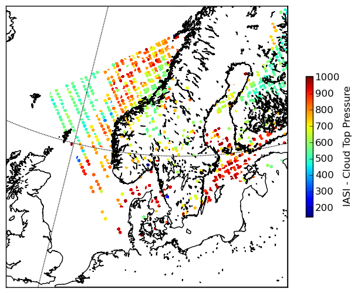

================
WMO file formats
================

Wether you like it or not, the *Binary Universal Form for the Representation of 
meteorological data* (BUFR) file format (see e.g. the WMO_ satellite file format pages)
is widely used even in satellite meteorology.
The format is used mostly for satellite sounder data, like NOAA AMSU and MHS and Metop 
IASI, which traditionally have been the primary satellite data going into the *Numerical 
Weather Prediction* (NWP) models.

Here we will demonstrate how python-bufr (python-bufr_) can be used to read satellite 
data in BUFR format.

The Grib file format is another WMO file format. Traditionally this has been the 
file format used for the output of NWP models, but it is occasionally also used for storing 
satellite products. For reading Grib files in python we refer to the excellent 
pygrib_ package. 

Use python-bufr
===============

The python-bufr depends on the ECMWF BUFR library and tables, and on numpy.
Please see the package documentation at python-bufr_ for installation and setup.

Once the ECMWF BUFR library and the python-bufr tool have been installed you will just
need to tell your environment where to find the BUFR tables and make sure your PYTHONPATH
includes the place where you have the python-bufr installed:

     export BUFR_TABLES=/path/bufrtables/

In the BUFR_TABLES directory you will have files (and symlinks) like shown here:

.. code-block:: ini

     lrwxrwxrwx 1 a000680 users     24 26 jan 14.19 D0000000000254013001.TXT -> D0000000000098013001.TXT*
     lrwxrwxrwx 1 a000680 users     24 26 jan 14.19 C0000000000254013001.TXT -> C0000000000098013001.TXT*
     lrwxrwxrwx 1 a000680 users     24 26 jan 14.09 B0000000000254013001.TXT -> B0000000000098013001.TXT*
     lrwxrwxrwx 1 a000680 users     24 26 jan 14.00 D0000000000254010001.TXT -> D0000000000098013001.TXT*
     lrwxrwxrwx 1 a000680 users     24 26 jan 14.00 D0000000000099010001.TXT -> D0000000000098013001.TXT*
     ...

Example on EUMETCast IASI level 2 product
=========================================

    >>> TESTFILE = "./sample_data/iasi_20120206_190254_metopa_27506_eps_o_clp.l2_bufr"
    >>> import bufr
    >>> import numpy as np
    >>> bfr = bufr.BUFRFile(TESTFILE)
    
Now lets just check what fields are in the file:

    >>> nxt = bfr.next()
    >>> print [ s.name for s in nxt ]

.. code-block:: ini
   
   ['SATELLITE IDENTIFIER                                            ',
    'IDENTIFICATION OF ORIGINATING/GENERATING CENTRE (SEE NOTE 10)   ',
     'SATELLITE INSTRUMENTS                                           ',
     'SATELLITE CLASSIFICATION                                        ',
     'YEAR                                                            ',
     'MONTH                                                           ',
   ...
   'HEIGHT OF STATION (SEE NOTE 1)                                  ',
   'VERTICAL SIGNIFICANCE (SATELLITE OBSERVATIONS)                  ',
   'PRESSURE                                                        ',
   'TEMPERATURE/DRY-BULB TEMPERATURE                                ',
   'CLOUD AMOUNT IN SEGMENT                                         ',
   'CLOUD PHASE                                                     ',
   'PRESSURE                                                        ',
   'TEMPERATURE/DRY-BULB TEMPERATURE                                ',
   'CLOUD AMOUNT IN SEGMENT                                         ',
   'CLOUD PHASE                                                     ',
   'PRESSURE                                                        ',
   'TEMPERATURE/DRY-BULB TEMPERATURE                                ',
   'CLOUD AMOUNT IN SEGMENT                                         ',
   'CLOUD PHASE                                                     ']

We want to look at the Cloud Top Pressure, but we see that there are actually
three PRESSURE fields in the file. In the BUFR file data are layed out sequentially,
and cointing the fields in the above name list gives that the pressure fields are located 
at index 32, 36 and 40. Lets see what they contain:

    >>> print len(nxt)
    44
    >>> print nxt[32].name
    'PRESSURE                                                        '
    >>> print nxt[32].data.min(), nxt[32].data.max()
    (14376.0, 1.7e+38)
    >>> print nxt[36].data.min(), nxt[36].data.max()
    (1.7e+38, 1.7e+38)
    >>> print nxt[40].data.min(), nxt[40].data.max()
    (1.7e+38, 1.7e+38)

So it seems the only field that contains data is the first one.
Let us extract all the data and the geolocation:

    >>> bfr = bufr.BUFRFile(TESTFILE)
    >>> lon = []
    >>> lat = []
    >>> pres = []
    >>> for record in bfr:
    >>>     for entry in record:
    >>>         if entry.index == 32:
    >>>             pres.append(entry.data)
    >>>         if entry.name.find("LONGITUDE") == 0:
    >>>             lon.append(entry.data)
    >>>         if entry.name.find("LATITUDE") == 0:
    >>>             lat.append(entry.data)
    >>> lons = np.concatenate(lon) 
    >>> lats = np.concatenate(lat)
    >>> pres = np.concatenate(pres) / 100.0 # hPa
    >>> pres = np.ma.masked_greater(pres, 1.0e+6)

Now we have an IASI granule with the level 2 CTP parameter.
It is geolocated, so we could project it to a user area and map projection.
We use pyresample_ for that of course, and a predefined area from a local configuration 
file (see further below):

    >>> import pyresample as pr
    >>> from pyresample import kd_tree, geometry
    >>> from pyresample import utils
    >>> swath_def = geometry.SwathDefinition(lons=lons, lats=lats)
    >>> area_def = utils.parse_area_file('/local_disk/opt/ACPG/cfg/region_config.cfg', 'scan2')[0]
    >>> result = kd_tree.resample_nearest(swath_def, pres,
                                  area_def, 
                                  radius_of_influence=12000, 
                                  epsilon=100,
                                  fill_value=None)
    >>> pr.plot.save_quicklook('/tmp/iasi_ctp_quick.png', 
                        area_def, result, label='IASI - Cloud Top Pressure',
                        coast_res = 'h')

The local area configuration is actually, in this case, taken from another project, 
namely the nwcsaf_. The NWCSAf PPS software use the same configuration style as
implemented in pyresample. In this particular case the area *scan2* is defined as 
shown below:

.. code-block:: ini
    
    REGION: scan2 {
        NAME:           Scandinavia - 2km area
        PCS_ID:         ps60n
        PCS_DEF:        proj=stere,ellps=bessel,lat_0=90,lon_0=14,lat_ts=60
        XSIZE:          1024
        YSIZE:          1024
        AREA_EXTENT:    (-1268854.1266382949, -4150234.8425892727, 779145.8733617051, -2102234.8425892727)
    };

.. _WMO:  http://www.wmo.int/pages/prog/sat/formatsandstandards_en.php
.. _pygrib: http://code.google.com/p/pygrib/
.. _python-bufr: http://code.google.com/p/python-bufr/
.. _pyresample: http://pyresample.googlecode.com/
.. _nwcsaf: http://nwcsaf.smhi.se/

