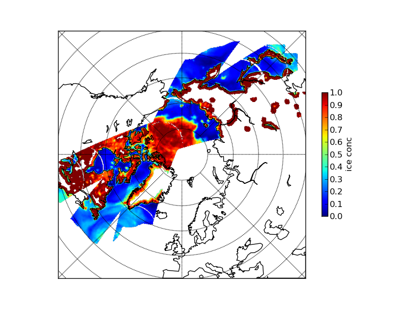

============================
 Quickstart with custom data
============================
For this tutorial, we will use SSM/I data from custom netCDF files, make an
mpop reader plugin, configure mpop to use it, implement an ice concentration
algorithm and plot the result.

In order to follow this tutorial pyresample_ and mpop_ is needed as well as the
python package netCDF4_. Install these packages first.

For this tutorial template config files (see :doc:`install`) can be used. These
are located in the *etc* dir of the mpop_ source. Copy *mpop.cfg.template* and
*areas.def.template* to another dir and remove the *.template* extension.

Set PPP_CONFIG_DIR to the directory containing your mpop_ config files.

Making mpop read custom files
=============================
In this tutorial we will configure mpop to read swath data from custom netCDF
files. The examples can be adapted to any kind of files as long as a reader is
available that returns data sets as numpy arrays.

The netCDF files in this example is from DMSP-F13 and have names of the type
ssmi_<number>_YYYYmmmmHHMM_sncp.nc

The netCDF files have variables with the names: *lon_l*, *lat_l*, *tb19v*,
*tb19h*, *tb22*, *tb37v* and *tb37h*.

Create a new mpop config file in the config file dir called *DMSP-F13.cfg* with
the content

.. code-block:: ini

    [satellite]
    variant = 
    instruments = ('ssmi',)

    [ssmi-level2]
    filename = ssmi_%(number)s_%Y%m%d%H%M_sncp.nc
    dir = /mnt/dvl/test_data/ssmi_nc
    format = ssmi_nc

    [ssmi-1]
    name = 'tb19v'

    [ssmi-2]
    name = 'tb19h'

    [ssmi-3]
    name = 'tb22'

    [ssmi-4]
    name = 'tb37v'

    [ssmi-5]
    name = 'tb37h'

The :attr:`ssmi-level2` section defines what reader plugin should be used by mpop in the :attr:`format` field. mpop will look for a module named *ssmi_nc.py* first among the builtin mpop modules and then in the PYTHONPATH. If mpop finds a module named *ssmi_nc.py* it will use its :meth:`load` function to read data. The :attr:`filename` and :attr:`dir` fields locate the data to be read by the reader.

The sections :attr:`ssmi-x` specifies the channels to mpop. In this example we do not specify wavelengths and resolutions to mpop.

Now create the reader plugin named *ssmi_nc.py* with the content::

    """Loader for ssmi, netcdf format.
    """

    from ConfigParser import ConfigParser
    from mpop import CONFIG_PATH
    import os

    from netCDF4 import Dataset

    def load(satscene):
        """Load ssmi data.
        """

        # Read config file content
        conf = ConfigParser()
        conf.read(os.path.join(CONFIG_PATH, satscene.fullname + ".cfg"))
        values = {"orbit": satscene.orbit,
                  "satname": satscene.satname,
                  "number": satscene.number,
                  "instrument": satscene.instrument_name,
                  "satellite": satscene.fullname
                  }
        filename = os.path.join(
            conf.get("ssmi-level2", "dir"),
            satscene.time_slot.strftime(conf.get("ssmi-level2",
                                                 "filename",
                                                 raw=True)) % values)
        
        # Load data from netCDF file
        ds = Dataset(filename, 'r')

        for chn_name in satscene.channels_to_load:
            # Read variable corresponding to channel name
            data = ds.variables[chn_name][:]
            satscene[chn_name] = data
            
        lons = ds.variables['lon_l'][:]
        lats = ds.variables['lat_l'][:]
        
        # Set scene area as pyresample geometry object
        try:
            from pyresample import geometry
            satscene.area = geometry.SwathDefinition(lons=lons, lats=lats)
        except ImportError:
            # pyresample not available. Set lon and lats directly
            satscene.area = None
            satscene.lat = lats
            satscene.lon = lons    

The actual data loading and populating is taking place in the lines after "Load data from netCDF file". These can be modified load any kind of data as long as the data sets are numpy arrays and :attr:`chn_name` in :attr:`satscene[chn_name] = data` is a channel name defined in the config file.

Make sure *ssmi_nc.py* is in the PYTHONPATH
 
Loading data
============
in this example it's assumed the netCDF files *ssmi_f13_200509151935_sncp.nc*, *ssmi_f13_200509152117_sncp.nc* and 
*ssmi_f13_200509152259_sncp.nc* are present in the :attr:`dir` defined in *DMSP-F13.cfg*

    >>> from mpop.satellites import PolarFactory
    >>> from datetime import datetime
    >>> time_slot = datetime(2005, 9, 15, 19, 35)
    >>> global_data = PolarFactory.create_scene("DMSP-F13", "", "ssmi", time_slot)
    >>> global_data.load(['tb19v'])
    >>> print global_data
    'tb19v: (-inf,-inf,-inf)μm, shape (30786,), resolution 0m'
    'tb19h: (-inf,-inf,-inf)μm, resolution 0m, not loaded'
    'tb22: (-inf,-inf,-inf)μm, resolution 0m, not loaded'
    'tb37v: (-inf,-inf,-inf)μm, resolution 0m, not loaded'
    'tb37h: (-inf,-inf,-inf)μm, resolution 0m, not loaded'

The *tb19v* channel has now been loaded. As nothing has been specified on wavelengths and resolutions in the config file these values are not set (the *-inf* and *0m* above).

The channel data can be retrieved as a numpy array:

    >>> data = global_data["tb19v"].data
    >>> print type(data)
    <class 'numpy.ma.core.MaskedArray'>

mpop has the capability to assemble swaths

    >>> from mpop import scene
    >>> global_data2 = PolarFactory.create_scene("DMSP-F13", "", "ssmi", datetime(2005, 9, 15, 21, 17))
    >>> global_data3 = PolarFactory.create_scene("DMSP-F13", "", "ssmi", datetime(2005, 9, 15, 22, 59))
    >>> global_data2.load(['tb19v'])
    >>> global_data3.load(['tb19v'])
    >>> global_all = scene.assemble_segments([global_data, global_data2, global_data3])
    >>> print global_all
    'tb19v: (-inf,-inf,-inf)μm, shape (105591,), resolution 0m'
    'tb19h: (-inf,-inf,-inf)μm, resolution 0m, not loaded'
    'tb22: (-inf,-inf,-inf)μm, resolution 0m, not loaded'
    'tb37v: (-inf,-inf,-inf)μm, resolution 0m, not loaded'
    'tb37h: (-inf,-inf,-inf)μm, resolution 0m, not loaded'   

Calculating geophysical parameters
==================================
In this example we will calculate the sea ice concentration based on the SSM/I data.

Create the file *ice_conc.py* with the content::

    def nasa_team(scene, area='nh'):

        if area == 'nh':
            a0, a1, a2, a3 = 3290.2, -20761.2, 23934.0, 47985.4
            b0, b1, b2, b3 = -790.9, 13825.3, -33155.8, -47771.9
            c0, c1, c2, c3 = 2035.3, 9244.6, -5665.8, -12875.1
        else:
            a0, a1, a2, a3 = 3055.0, -18592.6, 20906.9, 42554.5
            b0, b1, b2, b3 = -782.750, 13453.5, -33098.3, -47334.6
            c0, c1, c2, c3 = 2078.00, 7423.28, -3376.76, -8722.03

        PR = (scene['tb19v'] - scene['tb19h']) / (scene['tb19v'] + scene['tb19h'])
        GR = (scene['tb37v'] - scene['tb19v']) / (scene['tb37v'] + scene['tb19v'])

        D = c0 + c1 * PR + c2 * GR + c3 * PR * GR
        CF = (a0 + a1 * PR + a2 * GR + a3 * PR * GR) / D
        CM = (b0 + b1 * PR + b2 * GR + b3 * PR * GR) / D
        CT = CF + CM
        return CT

    nasa_team.prerequisites = ['tb19v', 'tb19h', 'tb37v', 'tb37h']
    
and make sure the file is in the PYTHONPATH.

Now the data needed to calculate the ice concentration is loaded and assembled:

    >>> import ice_conc
    >>> time_slot = datetime(2005, 9, 15, 19, 35)
    >>> global_data = PolarFactory.create_scene("DMSP-F13", "", "ssmi", time_slot)
    >>> global_data2 = PolarFactory.create_scene("DMSP-F13", "", "ssmi", datetime(2005, 9, 15, 21, 17))
    >>> global_data3 = PolarFactory.create_scene("DMSP-F13", "", "ssmi", datetime(2005, 9, 15, 22, 59))
    >>> global_data.load(ice_conc.nasa_team.prerequisites)
    >>> global_data2.load(ice_conc.nasa_team.prerequisites)
    >>> global_data3.load(ice_conc.nasa_team.prerequisites)
    >>> global_all = scene.assemble_segments([global_data, global_data2, global_data3])

The assembled scenes are combined into a new scene object (:attr:`global_all`) which can be used in the calculation:

    >>> ic = ice_conc.nasa_team(global_all)
    
The result can be reprojected and plotted:

    >>> from mpop.projector import get_area_def
    >>> from pyresample import plot
    >>> global_all["ic"] = ic
    >>> local_data = global_all.project("ease_nh", ["ic"], mode="nearest", radius=25000)
    >>> nh = get_area_def("ease_nh")
    >>> plot.show_quicklook(nh, local_data["ic"].data, vmin=0, vmax=1, label="ice conc")

.. _mpop: http://www.github.com/mraspaud/mpop
.. _pyresample: http://pyresample.googlecode.com
.. _netCDF4: http://code.google.com/p/netcdf4-python/

