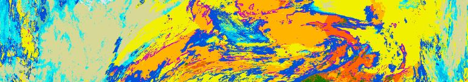
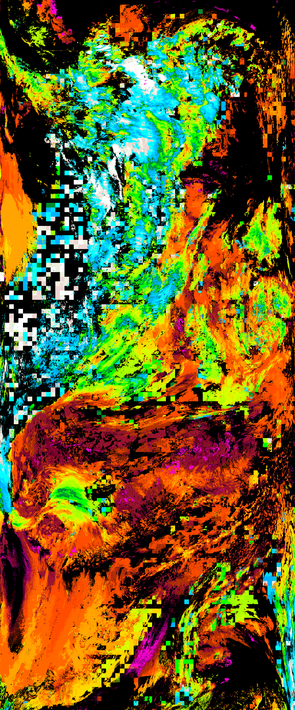
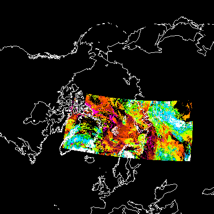
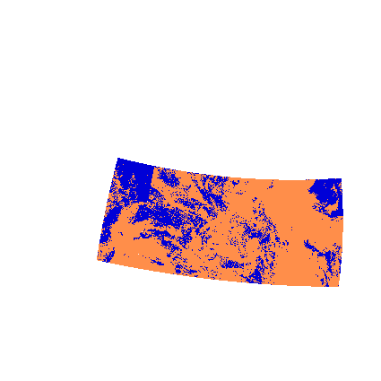

.. meta::
   :description: Reading EARS-NWC cloud products from NWC SAF PPS on NOAA/Metop AVHRR with python
   :keywords: EARS, NWC, AVHRR, NOAA, Metop, Nowcasting SAF, PPS, Cloud, Parameters, reader, read, reading, python, pytroll

=========================
 Quickstart with EARS-NWC
=========================

In December 2012 EUMETSAT_ extended the EARS_ services to include a new pilot
service with the purpose of supporting European users with cloud information
from polar orbiting satellites in near real time.

This *EARS-NWC* service provides the parameters *Cloud Mask*, *Cloud Type* and
*Cloud Top Temperature and Height (CTTH)* as derived using the Polar Platform
System (PPS_) software package from the `NWC SAF`_. The products are derived
from AVHRR data received at the EARS core stations with a reception coverage
including Europe and the North Atlantic. Products are disseminated on
EUMETCast_ (EUMETSAT `data channel 1`_) with a timeliness better than 30
minutes, and available in netCDF4 format. The geolocation information is available
on a tie-point grid and stored in each product.

At the moment the satellites contributing to the service are Metop-B and NOAA-19.

For this tutorial template config files (see :doc:`install`) can be used. These
are located in the *etc* dir of the mpop_ source. Copy *mpop.cfg.template*,
*areas.def.template*. *EARSNOAA-19.cfg.template*, and
*EARSMetop-B.cfg.template* to another dir and remove the *.template*
extension. In the config file *EARSMetop-B.cfg* locate the section
:attr:`avhrr-level3` and modify the defined :attr:`dir` to point to the dir of
your ears-nwc (bzip2 compressed) netCDF files. The section :attr:`avhrr-level3`
should look something like this:

.. code-block:: ini

    [avhrr-level3]
    cloud_product_dir = /path/to/my/ears/nwc/data
    cloud_product_filename = W_XX-EUMETSAT-Darmstadt,SING+LEV+SAT,METOPB+%(product)s_C_EUMS_%Y%m%d%H%M00_*.nc*
    cloud_product_geofilename = W_XX-EUMETSAT-Darmstadt,SING+LEV+SAT,METOPB+CMA_C_EUMS_%Y%m%d%H%M00_*.nc*
    geolocation_product_name = CMA
    format = nc_pps_l2.PPSReader

Set PPP_CONFIG_DIR to the directory containing your modified mpop_ config files.

Loading
=======

    >>> from mpop.satellites import PolarFactory
    >>> from datetime import datetime
    >>> time_slot = datetime(2015, 10, 28, 15, 56)
    >>> orbit = ""
    >>> gbd = PolarFactory.create_scene(
              "Metop-B", "", "avhrr/3", time_slot, orbit, variant='EARS')
    >>> gbd.load(['CT'])
    No handlers could be found for logger "mpop.satin.nc_pps_l2"

Now we have loaded the Cloudtype product granule

    >>> print gbd['CT'].ct.data
    [[11 11 13 ..., 8 8 7]
     [11 13 13 ..., 8 8 8]
     [11 13 13 ..., 8 8 8]
     ..., 
     [8 8 8 ..., 7 7 7]
     [8 8 8 ..., 7 7 7]
     [8 8 8 ..., 7 7 7]]

Also the geolocation has been unpacked. That is the the full resolution
geolocation information has been recreated from the tie point grid by
interpolating and extrapolating the longitudes and latitudes on the tie point
grid. This is accomplished using the python-geotiepoints_ tool, but this is
transparent to the user:

    >>> print gbd['CT'].area.lats.shape
    (360, 2048)

Now let's visualise the cloudtype data using the Nowcasting SAF palette read
from the file:

    >>> from mpop.imageo import geo_image
    >>> palette = gbd['CT'].mda["ct_pal"]
    >>> ctype = gbd["CT"].ct.data
    >>> img = geo_image.GeoImage(ctype, 
                                 gbd.area, 
                                 gbd.time_slot, 
                                 fill_value=(255), 
                                 mode="P", 
                                 palette=palette / 255.0)
    >>> img.show()

Reading many granules
=====================

Instead of reading one granule you can read a bunch of granules and let mpop
concatenate them for you. Either you specify exactly what files to load via the
*filename* argument or you provide a start and end time and use the
*time_interval* argument. Here is how it is done when loading the CTTH product
using the *time_interval* argument:

.. code-block:: python

    >>> starttime = datetime(2015, 10, 28, 15, 53)
    >>> endtime = datetime(2015, 10, 28, 16, 9)
    >>> orbit = ""
    >>> gbd = PolarFactory.create_scene(
                "Metop-B", "", "avhrr/3", starttime, orbit, variant='EARS')
    >>> gbd.load(['CTTH'], time_interval=(starttime, endtime))
    >>> lcd = gbd.project('ease_nh')

    >>> from mpop.imageo import geo_image
    >>> import numpy as np
    >>> height = lcd["CTTH"].ctth_alti.data
    >>> palette = lcd['CTTH'].mda["ctth_alti_pal"]
    >>> img = geo_image.GeoImage((height / 500 + 1).astype(np.uint8), 
                                 lcd.area, 
                                 lcd.time_slot, 
                                 fill_value=(0), 
                                 mode="P", 
                                 palette=palette / 255.0)
    >>> img.show()

And then add coast lines using pycoast_:

.. code-block:: python

    >>> from pyresample import utils
    >>> import os
    >>> PPP_CONFIG_DIR = os.environ.get("PPP_CONFIG_DIR")
    >>> AREA_CONFIG_FILE = os.path.join(PPP_CONFIG_DIR, "areas.def")
    >>> area_def = utils.parse_area_file(AREA_CONFIG_FILE, 'ease_nh')[0]

    >>> from pycoast import ContourWriter
    >>> cw_ = ContourWriter('/home/a000680/data/shapes')
    >>> img = img.pil_image()
    >>> cw_.add_coastlines(img, area_def, resolution='c', level=1)
    >>> img.show()

And provided you know which files you want to look at you can use file globbing
and the *filename* argument like this:

.. code-block:: python

    >>> from glob import glob
    >>> filenames = glob("/local_disk/data/ears/nwc/20151028/*")
    >>> starttime = None
    >>> orbit = ""
    >>> gbd = PolarFactory.create_scene(
                "Metop-B", "", "avhrr/3", starttime, orbit, variant='EARS')
    >>> gbd.load(['CMA', 'CT', 'CTTH'], filename=filenames)

    >>> lcd = gbd.project('ease_nh')
    >>> img = lcd.image.cma_rgb()
    >>> img.show()

Observe that we do not specify a time for the scene, as this is not mandatory
when we load using a list of filenames. However, it is required if you want to
save the final product in geoTIFF or a netCDF format as the observation time is
a required attribute upon writing.

.. _EARS: http://www.eumetsat.int/home/main/satellites/groundnetwork/earssystem/index.htm
.. _EUMETCast: http://www.eumetsat.int/home/main/dataaccess/eumetcast/index.htm
.. _EUMETSAT: http://www.eumetsat.int/
.. _`NWC SAF`: http://www.nwcsaf.org/
.. _PPS: http://nwcsaf.smhi.se/
.. _python-geotiepoints: http://www.github.com/adybbroe/python-geotiepoints
.. _mpop: http://www.github.com/mraspaud/mpop
.. _pyresample: http://pyresample.googlecode.com
.. _pycoast: http://pycoast.googlecode.com
.. _`data channel 1`: http://www.eumetsat.int/home/main/dataaccess/eumetcast/receptionstationset-up/sp_20100623124251305?l=en
