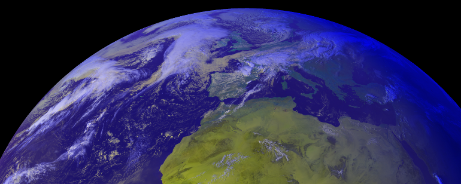
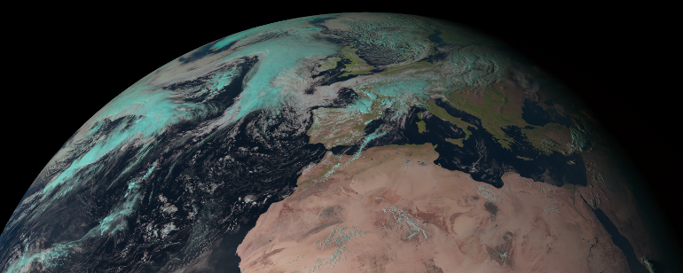
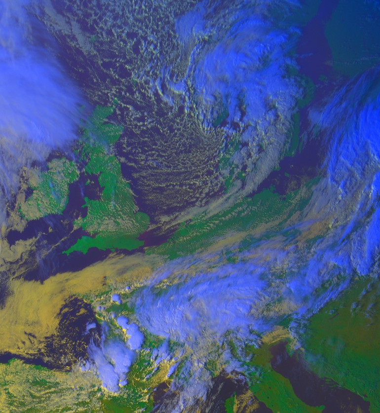

.. -*- coding: utf-8 -*-

===========================
 Quickstart with MSG SEVIRI
===========================

For this tutorial, we will use the Meteosat data in the uncompressed EUMETSAT HRIT format, read it through mipp_ into
mpop_, resample it with pyresample_ and process it a bit. Install theses packages first.

Software to uncompress HRIT can be obtained from EUMETSAT (register and download the `Public Wavelet Transform Decompression Library Software`_)

For this tutorial template config files (see :doc:`install`) can be used. These are located in the *etc* dir of the mpop_ source. Copy *mpop.cfg.template*, *areas.def.template* and *meteosat09.cfg.template* to another dir and remove the *.template* extension. In the config file *meteosat09.cfg* locate the section :attr:`severi-level1` and modify the defined :attr:`dir` to point to the dir of your uncompressed HRIT data. 

Set PPP_CONFIG_DIR to the directory containing your modified mpop_ config files.

.. tip:: Using wildcards in the *meteosat09.cfg* file allows mpop to adapt to
   any changes on the operation satellite for the 0 degree service (for exemple
   in case of satellite switch, for maintenance or when the successor satellite
   comes in).

First example: Loading data
===========================
This example assumes uncompressed EUMETSAT HRIT data for 8/10-2009 14:30 exists in the :attr:`dir` defined in the :attr:`severi-level1` section of your meteosat09 configuration file. Change the arguments to the creation of :attr:`time_slot` in the code example to match the time slot of your HRIT data.  

Ok, let's get it on::

    >>> from mpop.satellites import GeostationaryFactory
    >>> from mpop.projector import get_area_def
    >>> import datetime
    >>> time_slot = datetime.datetime(2009, 10, 8, 14, 30)
    >>> global_data = GeostationaryFactory.create_scene("meteosat", "09", "seviri", time_slot)
    >>> europe = get_area_def("EuropeCanary")
    >>> global_data.load([0.6, 0.8, 10.8], area_extent=europe.area_extent)
    >>> print global_data
    'VIS006: (0.560,0.635,0.710)μm, shape (1200, 3000), resolution 3000.40316582m'
    'VIS008: (0.740,0.810,0.880)μm, shape (1200, 3000), resolution 3000.40316582m'
    'IR_016: (1.500,1.640,1.780)μm, resolution 3000.40316582m, not loaded'
    'IR_039: (3.480,3.920,4.360)μm, resolution 3000.40316582m, not loaded'
    'WV_062: (5.350,6.250,7.150)μm, resolution 3000.40316582m, not loaded'
    'WV_073: (6.850,7.350,7.850)μm, resolution 3000.40316582m, not loaded'
    'IR_087: (8.300,8.700,9.100)μm, resolution 3000.40316582m, not loaded'
    'IR_097: (9.380,9.660,9.940)μm, resolution 3000.40316582m, not loaded'
    'IR_108: (9.800,10.800,11.800)μm, shape (1200, 3000), resolution 3000.40316582m'
    'IR_120: (11.000,12.000,13.000)μm, resolution 3000.40316582m, not loaded'
    'IR_134: (12.400,13.400,14.400)μm, resolution 3000.40316582m, not loaded'
    'HRV: (0.500,0.700,0.900)μm, resolution 1000.13434887m, not loaded'

In this example, we create an mpop_ scene object (:attr:`global_data`) for the seviri instrument
onboard meteosat 9, specifying the time of the scene of interest. The time
is defined as a datetime object.

The :meth:`get_area_def` function reads an area definition from the configuration file  *area.def* in the PPP_CONFIG_DIR. The area definition is read into the variable :attr:`europe` which then gives access information about the area like projection and extent. 

The next step is loading the data. This is done using mipp_, which takes care of
reading the HRIT data, and slicing the data so that we read just what is
needed. Calibration is also done with mipp_. 

Here we call the :meth:`load` function with a list of the wavelengths of the
channels we are interested in, and the area extent in satellite projection of
the area of interest. Each retrieved channel is the closest in terms of central
wavelength, provided that the required wavelength is within the bounds of the
channel. Note: If you have not installed the numexpr_ package on your system you get the warning *"Module numexpr not found. Performance will be slower"*. This only affects the speed of loading SEVIRI data.

The wavelengths are given in micrometers and have to be given as a floating
point number (*i.e.*, don't type '1', but '1.0'). Using an integer number
instead returns a channel based on resolution, while using a string retrieves a
channels based on its name.

Retrieving the same channels base on channel name would be

    >>> global_data.load(['VIS006', 'VIS008', 'IR_108'], area_extent=europe.area_extent)

The :attr:`area_extent` keyword argument in the :meth:`load` method specifies the subsection of the image to load in satellite projection coordinates. In this case the *EuropeCanary* is an area definition in the *geos* projection defined in the *area.def* file used by mpop_ (this area is provided in the mpop_ template *area.def*). If the :attr:`area_extent` keyword argument is not provided the full globe image is loaded.

Making RGB composites
=====================
The :meth:`load` functions return an mpop_ scene object (:attr:`global_data`). The scene object is composed with an object named :attr:`image` which handles the creation of RGBs

    >>> img = global_data.image.overview()
    >>> img.save("./myoverview.png")
    >>>

Here we use the loaded data to generate an overview RGB composite image, and
save it as a png image. Instead of :meth:`save`, one could also use
:meth:`show` if the only purpose is to display the image on screen.

We want more !
==============

In the last example, the composite generation worked because the channels
needed for the overview (0.6, 0.8, 10.8 μm) were loaded. If we try to generate
a day natural color composite, which requires also the 1.6um channel, it will
result in an error::

   
    >>> img = global_data.image.natural()
    Traceback (most recent call last):
      ...
    NotLoadedError: Required channel 1.63 not loaded, aborting.

So it means that we have to load the missing channel first. To do this we could
enter the channels list to load manually, as we did for the overview, but we
provide a way to get the list of channels needed by a given method using the
:attr:`prerequisites` method attribute::

    >>> global_data.load(global_data.image.natural.prerequisites, area_extent=europe.area_extent)
    >>> img = global_data.image.natural()
    >>>

Now you can save the image::

    >>> img.save("./mynaturalcolors.png")
    >>>

If you want to combine several prerequisites for channel loading, since
prerequisites are python sets, you can do::

    >>> global_data.load(global_data.image.overview.prerequisites | 
    ...                  global_data.image.natural.prerequisites,
    ...                  area_extent=europe.area_extent)
    >>>

and add as many :attr:`| global_data.image.mymethod.prerequisites` as needed.

A description of the available builtin composites for SEVIRI and VISIR derived sensors can be seen using::

    >>> from mpop.instruments.visir import VisirScene
    >>> help(VisirScene)

The builtin composites are recommendations from the `MSG Interpretation Guide`_

Retrieving channels
===================

Retrieving channels is dead easy. From the center wavelength::

   >>> print global_data[0.6]
   'VIS006: (0.560,0.635,0.710)μm, shape (1200, 3000), resolution 3000.40316582m'

or from the channel name::

   >>> print global_data["VIS006"]
   'VIS006: (0.560,0.635,0.710)μm, shape (1200, 3000), resolution 3000.40316582m'

The printed lines consists of the following values:

* First the name is displayed,
* then the triplet gives the min-, center-, and max-wavelength of the
  channel,
* follows the shape of the loaded data, or `None` if the data is not loaded,
* and finally the theoretical resolution of the channel is shown.

The data of the channel can be retrieved as an numpy (masked) array using the
data property::
  
   >>> print global_data[0.6].data
   [[-- -- -- ..., -- -- --]
    [-- -- -- ..., -- -- --]
    [-- -- -- ..., -- -- --]
    ..., 
    [0.0 0.0 0.0 ..., 33.3433285237 33.6384022275 33.83511803]
    [0.0 0.0 0.0 ..., 33.441686425 33.6384022275 33.83511803]
    [0.0 0.0 0.0 ..., 33.5400443262 33.83511803 34.1301917337]]

Channels can be viewed with the :meth:`show` method::

  >>> global_data.image.channel_image(0.6).show()

.. image:: images/ch6.png
   

Channel arithmetics
===================

The common arithmetical operators are supported on channels, so that one can
run for example::

  >>> cool_channel = (global_data[0.6] - global_data[0.8]) * global_data[10.8]

Projections
===========

Until now, we have used the channels directly as provided by the satellite,
that is in satellite projection. Generating composites thus produces views in
satellite projection, *i.e.* as viewed by the satellite.

Most often however, we will want to project the data onto a specific area so
that only the area of interest is depicted in the RGB composites.

Here is how we do that::

    >>> local_data = global_data.project("euro_north")
    >>>

The area *euro_north* is defined in the *areas.def* file in PPP_CONFIG_DIR. In the sample *area.def* file this is a Stereographic projection of the european area.

Now we have projected data onto the *euro_north* area in the :attr:`local_data` variable
and we can operate as before to generate and play with RGB composites::

    >>> img = local_data.image.overview()
    >>> img.save("./local_overview.tif")
    >>>

.. image:: images/euro_north.png

The image is saved here in GeoTiff_ format. 

Making custom composites
========================

Building custom composites makes use of the :mod:`imageo` module. For example,
building an overview composite can be done manually with::

    >>> from mpop.imageo.geo_image import GeoImage
    >>> img = GeoImage((global_data[0.6].data, 
    ...                 global_data[0.8].data, 
    ...                 -global_data[10.8].data),
    ...                 "EuropeCanary",
    ...                 time_slot,
    ...                 mode = "RGB")
    >>> img.enhance(stretch="crude")
    >>> img.enhance(gamma=1.7)

In order to have mpop automatically use the composites you create, it is
possible to write them in a python module which name has to be specified in the
`mpop.cfg` configuration file, under the :attr:`composites` section. Change the *mpop.cfg* file to have the following line::

  [composites]
  module=my_composites

Now create a file named *my_composites.py* in a local dir with the content::

  from mpop.imageo.geo_image import GeoImage

  def hr_visual(self):
      """Make a High Resolution visual BW image composite from Seviri
      channel.
      """
      self.check_channels("HRV")

      img = GeoImage(self["HRV"].data, self.area, self.time_slot,
                     fill_value=0, mode="L")
      img.enhance(stretch="crude")
      return img

  hr_visual.prerequisites = set(["HRV"])

  def hr_overview(self):
      """Make a High Resolution Overview RGB image composite from Seviri
      channels.
      """
      self.check_channels(0.635, 0.85, 10.8, "HRV")

      ch1 = self[0.635].check_range()
      ch2 = self[0.85].check_range()
      ch3 = -self[10.8].data

      img = GeoImage((ch1, ch2, ch3), self.area, self.time_slot,
                     fill_value=(0, 0, 0), mode="RGB")

      img.enhance(stretch="crude")
      img.enhance(gamma=[1.6, 1.6, 1.1])

      luminance = GeoImage((self["HRV"].data), self.area, self.time_slot,
                           crange=(0, 100), mode="L")

      luminance.enhance(gamma=2.0)

      img.replace_luminance(luminance.channels[0])

      return img

  hr_overview.prerequisites = set(["HRV", 0.635, 0.85, 10.8])

  seviri = [hr_visual, hr_overview] 

Note the :attr:`seviri` variable in the end. This means that the composites it
contains will be available to all scenes using the Seviri instrument. If we
replace this by::

  meteosat09seviri = [overview,
                      hr_visual]

then the composites will only be available for the Meteosat 9 satellite scenes.

In *my_composites.py* we have now defined 2 custom composites using the HRV channel. 
:attr:`hr_visual` makes an enhanced black and white image from the HRV channel alone. 
:attr:`hr_overview` is a more complex composite using the HRV channel as luminance for the overview image from the previous example. This creates the perception of higher resolution.

Add the dir containing *my_composites.py* to your PYTHONPATH. Now your new composites will be accessible on the :attr:`scene.image` object like the builtin composites::

    >>> from mpop.satellites import GeostationaryFactory
    >>> from mpop.projector import get_area_def
    >>> import datetime
    >>> time_slot = datetime.datetime(2009, 10, 8, 14, 30)
    >>> global_data = GeostationaryFactory.create_scene("meteosat", "09", "seviri", time_slot)
    >>> msghrvn = get_area_def("MSGHRVN")
    >>> global_data.load(global_data.image.hr_overview.prerequisites, area_extent=msghrvn.area_extent)   
    >>> local_data = global_data.project("euro_north")
    >>> img = local_data.image.hr_overview()
    >>> img.show()

.. _GeoTiff: http://trac.osgeo.org/geotiff/
.. _mpop: http://www.github.com/mraspaud/mpop
.. _mipp: http://www.github.com/loerum/mipp
.. _pyresample: http://pyresample.googlecode.com
.. _numexpr: http://code.google.com/p/numexpr/
.. _Public Wavelet Transform Decompression Library Software: http://www.eumetsat.int/Home/Main/DataAccess/SupportSoftwareTools/index.htm?l=en
.. _MSG Interpretation Guide: http://oiswww.eumetsat.org/WEBOPS/msg_interpretation/index.php 
