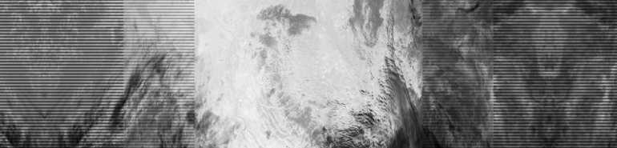
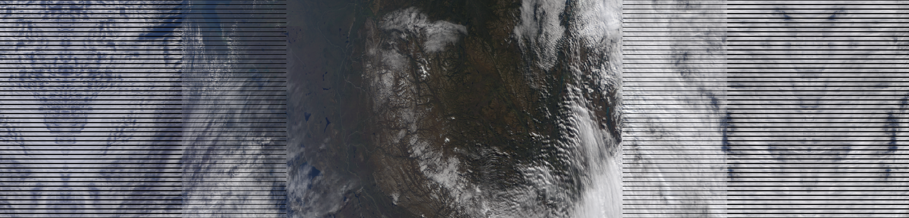
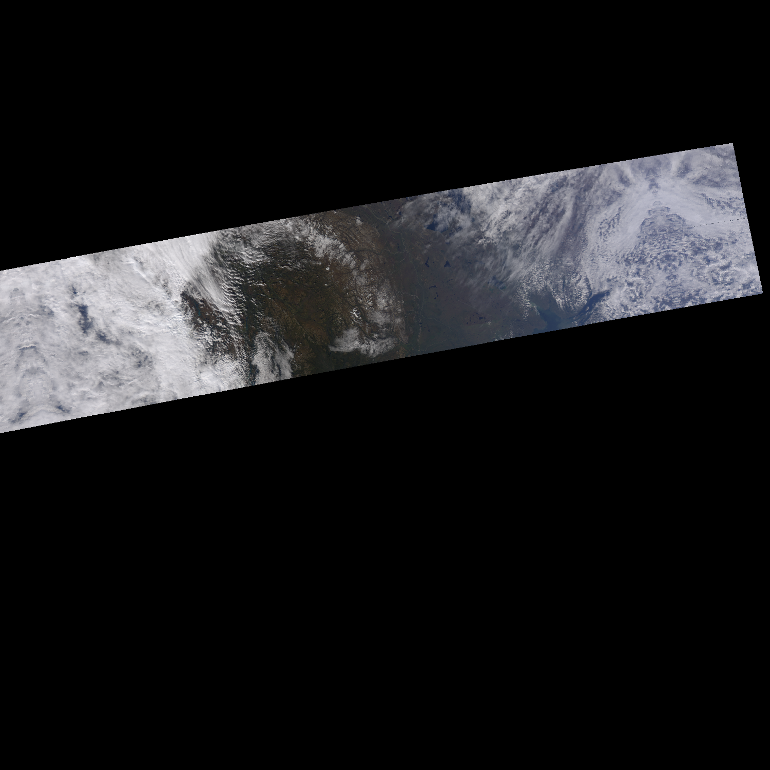

==================
Pytroll goes VIIRS
==================
The NOAA/NASA weather satellite NPOESS Preparatory Project (NPP) satellite is due for 
launch October 25th, 2011. `NPP sample`_ data have been made 
available to the public mid September 2011. NPP has a MODIS/AVHRR like imager 
onboard, called the Visible Infrared Imager Radiometer Suite (VIIRS).

In preparation for the upcoming VIIRS data we have made a plugin reader and custom 
compositer to mpop_.
Thus it is now possible to generate RGB image composites also for VIIRS.

We have so far only added support M-bands. Support for I-bands and the Day/Night band will follow.

Loading
=======

    >>> from mpop.satellites import PolarFactory
    >>> import datetime
    >>> time_slot = datetime.datetime(2010, 9, 6, 21, 5)
    >>> orbit = "00012"
    >>> global_data = PolarFactory.create_scene("npp", "1", "viirs", time_slot, orbit)
    >>> global_data.load([8.6])
    >>> print global_data
    ------> print(global_data)
    'M01: (0.402,0.412,0.422)μm, resolution 750m, not loaded'
    'M02: (0.436,0.445,0.454)μm, resolution 750m, not loaded'
    'M03: (0.478,0.488,0.498)μm, resolution 750m, not loaded'
    'M04: (0.545,0.555,0.565)μm, resolution 750m, not loaded'
    'M05: (0.662,0.672,0.682)μm, resolution 750m, not loaded'
    'M06: (0.739,0.746,0.754)μm, resolution 750m, not loaded'
    'M07: (0.846,0.865,0.885)μm, resolution 750m, not loaded'
    'M08: (1.230,1.240,1.250)μm, resolution 750m, not loaded'
    'M09: (1.371,1.378,1.386)μm, resolution 750m, not loaded'
    'M10: (1.580,1.610,1.640)μm, resolution 750m, not loaded'
    'M11: (2.225,2.250,2.275)μm, resolution 750m, not loaded'
    'M12: (3.610,3.700,3.790)μm, resolution 750m, not loaded'
    'M13: (3.973,4.050,4.128)μm, resolution 750m, not loaded'
    'M14: (8.400,8.550,8.700)μm, shape (768, 3200), resolution 750m'
    'M15: (10.263,10.763,11.263)μm, resolution 750m, not loaded'
    'M16: (11.538,12.013,12.489)μm, resolution 750m, not loaded'

We have now loaded the VIIRS M14 band, and we can display it if we want:
 
    >>> global_data.image.channel_image(8.6).show()

Making RGB's
============

Here is an example making a true color RGB with the VIIRS bands:

    >>> global_data.load(global_data.image.trucolor.prerequisites)
    >>> img = global_data.image.trucolor()
    >>> img.save("./viirs_trucolor.png")

Map projection
==============

Reprojecting data is done in exactly the same way the AVHRR data was reprojected in the :doc:`quickstart_avhrr` tutorial:

    >>> local_data = global_data.project("npp_sample_m", mode="nearest")
    >>> img = local_data.image.trucolor()
    >>> img.save('./viirs_trucolor_proj.png')

Here we have defined an area called *npp_sample_m* covering parts of western central US. 
This definition is stored in the *areas.def.template* file. See 
the :doc:`quickstart_avhrr` tutorial.

.. _`NPP sample`: http://npp.gsfc.nasa.gov/NPP_NCT4_SAMPLE_PRODUCTS.zip
.. _mpop: http://www.github.com/mraspaud/mpop

