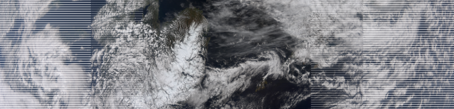
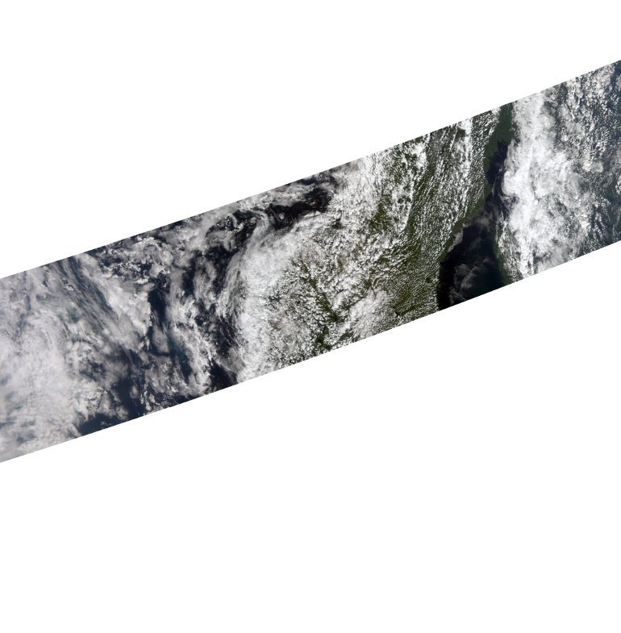
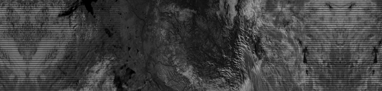
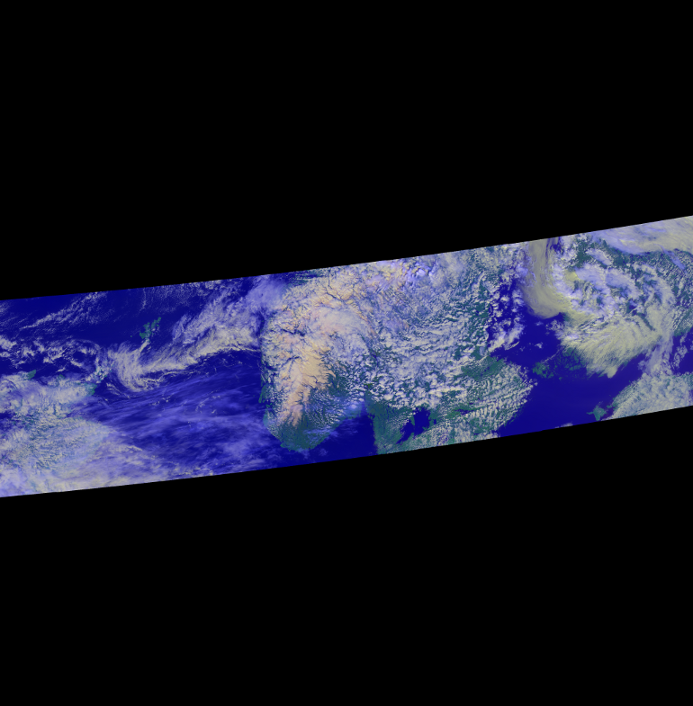
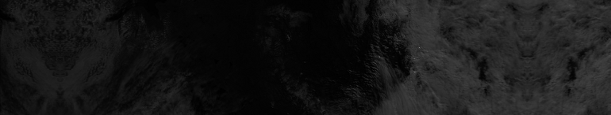

==================
Pytroll goes VIIRS
==================
The NOAA/NASA weather satellite NPOESS Preparatory Project (NPP) satellite is due for 
launch October 25th, 2011. `NPP sample`_ data have now finally been made 
available to the public. NPP has a MODIS/AVHRR like imager 
onboard, called the Visible Infrared Imager Radiometer Suite (VIIRS).

In preparation for the upcoming VIIRS data we have made a plugin reader and custom 
compositer to mpop_.
Thus it is now possible to generate RGB image composites also for VIIRS.

For this tutorial template config files (see :doc:`install`) can be used. 
These are located in the *etc* dir of the mpop_ source. Copy *mpop.cfg.template*, *areas.def.template* 
and *npp1.cfg.template* to another dir and remove the *.template* extension. In the config file 
*npp1.cfg* locate the section :attr:`viirs-level2` and modify the defined :attr:`dir` 
to point to the dir of your NPP sample SDR data.

Set PPP_CONFIG_DIR to the directory containing your modified mpop_ config files.

Loading
=======

    >>> from mpop.satellites import PolarFactory
    >>> import datetime
    >>> time_slot = datetime.datetime(2010, 9, 6, 21, 5)
    >>> orbit = "00012"
    >>> global_data = PolarFactory.create_scene("npp", "1", "viirs", time_slot, orbit)
    >>> global_data.load([8.6])
    >>> print global_data
    -------> print(global_data)
    'M01: (0.402,0.412,0.422)μm, resolution 742m, not loaded'
    'M02: (0.436,0.445,0.454)μm, resolution 742m, not loaded'
    'M03: (0.478,0.488,0.498)μm, resolution 742m, not loaded'
    'M04: (0.545,0.555,0.565)μm, resolution 742m, not loaded'
    'M05: (0.662,0.672,0.682)μm, resolution 742m, not loaded'
    'M06: (0.739,0.746,0.754)μm, resolution 742m, not loaded'
    'M07: (0.846,0.865,0.885)μm, resolution 742m, not loaded'
    'M08: (1.230,1.240,1.250)μm, resolution 742m, not loaded'
    'M09: (1.371,1.378,1.386)μm, resolution 742m, not loaded'
    'M10: (1.580,1.610,1.640)μm, resolution 742m, not loaded'
    'M11: (2.225,2.250,2.275)μm, resolution 742m, not loaded'
    'M12: (3.610,3.700,3.790)μm, resolution 742m, not loaded'
    'M13: (3.973,4.050,4.128)μm, resolution 742m, not loaded'
    'M14: (8.400,8.550,8.700)μm, shape (768, 3200), resolution 742m'
    'M15: (10.263,10.763,11.263)μm, resolution 742m, not loaded'
    'M16: (11.538,12.013,12.489)μm, resolution 742m, not loaded'
    'I01: (0.600,0.640,0.680)μm, resolution 371m, not loaded'
    'I02: (0.845,0.865,0.884)μm, resolution 371m, not loaded'
    'I03: (1.580,1.610,1.640)μm, resolution 371m, not loaded'
    'I04: (3.580,3.740,3.900)μm, resolution 371m, not loaded'
    'I05: (10.500,11.450,12.300)μm, resolution 371m, not loaded'
    'DNB: (0.500,0.700,0.900)μm, resolution 742m, not loaded'

We have now loaded the VIIRS M14 band, and we can display it if we want:
 
    >>> global_data[8.6].show()

.. image:: images/viirs_tb86.png

The black stripes are due to the so called *bowtie deletion*, which is handled onboard the
satellite. The bowtie effect is a geometric feature of the VIIRS scan. Similar to the MODIS
sensor individual VIIRS lines will overlap as one approach the edge of the swath.
These overlapping samples/pixels have been removed, and thus when data are displayed 
un-projected these no-data lines will appear. 

Making RGB's
============

Here is an example making a true color RGB with the VIIRS bands:

    >>> global_data.load(global_data.image.truecolor.prerequisites)
    >>> img = global_data.image.truecolor()
    >>> img.save("./viirs_truecolor.png")

Map projection
==============

Reprojecting data is done in exactly the same way the AVHRR data was reprojected in 
the :doc:`quickstart_avhrr` tutorial:

    >>> local_data = global_data.project("npp_sample_m", mode="nearest")
    >>> img = local_data.image.truecolor()
    >>> img.save('./viirs_truecolor_proj.png')

Here we have defined an area called *npp_sample_m* covering parts of western central US. 
This definition is stored in the *areas.def.template* file. See 
the :doc:`quickstart_avhrr` tutorial.

High resolution images
======================
The VIIRS sensor have 5 AVHRR-like channels with a resolution almost 3 times better.
These are the I-bands seen in the list above. Making imagery from these goes exactly the same 
way as for the M-bands. However, since there is overlap in the spectral range between I-bands and
M-bands, you need to specify also the resolution or use the band name when loading:

    >>> global_data.load(['I03'])
    >>> global_data['I03'].show()

Generating and mapping the overview of the I-bands is done in the same way as for the M-bands of course.
Here we have made a specific I-band overview method called *hr_overview*:

    >>> from mpop.satellites import PolarFactory
    >>> import datetime
    >>> time_slot = datetime.datetime(2010, 9, 6, 21, 5)
    >>> orbit = "00012"
    >>> global_data = PolarFactory.create_scene("npp", "1", "viirs", time_slot, orbit)
    >>> global_data.load(global_data.image.hr_overview.prerequisites)
    >>> local_data = global_data.project("npp_sample_i", mode="nearest")
    >>> img = local_data.image.hr_overview()
    >>> img.show()

The Day/Night Band
==================

The VIIRS Day/Night band draws heritage from the DMSP Operational Linescan System (OLS) and is a broad band channel in the Visible and Near-Infrared spectral range. It operates with three different gains to optimise the sensitivity independant of illumination:

    >>> global_data.load(['DNB'])
    >>> global_data['DNB'].show()

During nighttime it is sufficiently sensitive so that useful information on clouds and surfaces may be deduced from reflected moonlight. Naturally the units of this band cannot be given as a solar reflectance factor, but instead the radiance is provided:

    >>> print global_data['DNB'].info
        {'units': 'W sr-1 m-2', 'band_id': 'DNB'}

The units in the HDF5 SDR file is W/(sr*cm²) (see table 2.18.2-1, page 355 of the NPOESS Common Data Format Control Book - Volume III - D34862-03 Rev E CDRL No. A014). But in pytroll we keep to the physical units 
dictated by the netCDF `CF convention`_ on metadata, which is W/(sr*m²). 

Observe that this is really the spectral radiance *integrated* over the entire band of wavelengths from 500 to 900 nm, and *not* a spectral radiance (e.g. unit W/(sr*m²*μm) which is otherwise common for narrow band channels.
 

    >>> print global_data['DNB'].data
    [[-- 25.2138214111 24.7121238708 ..., 34.5851135254 36.7595329285
      36.4250068665]
     [-- 25.3448677063 24.8431777954 ..., 36.0533599854 37.0569000244
      37.3914108276]
     [-- 24.6817951202 25.1834983826 ..., 36.3937034607 36.8954811096
      36.8954811096]
     ..., 
     [-- 36.6459617615 35.9773178101 ..., 80.6140975952 80.7809295654
      82.6159896851]
     [-- 39.8229789734 40.4916000366 ..., 77.9451217651 78.2787780762
      78.2787780762]
     [-- 33.1762428284 39.5281829834 ..., 76.9774246216 78.8123092651
     78.3118972778]]

We can check the range of radiaces in the granule and in print it in the units given in the input file if we like:

    >>> print (global_data['DNB'].data * 10000).min()
    21831.6
    >>> print (global_data['DNB'].data * 10000).max()
    4e+06

.. _`CF convention`: http://cf-pcmdi.llnl.gov/
.. _`NPP sample`: http://npp.gsfc.nasa.gov/NPP_NCT4_SAMPLE_PRODUCTS.zip
.. _mpop: http://www.github.com/mraspaud/mpop

