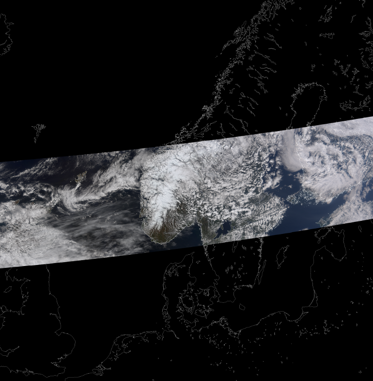
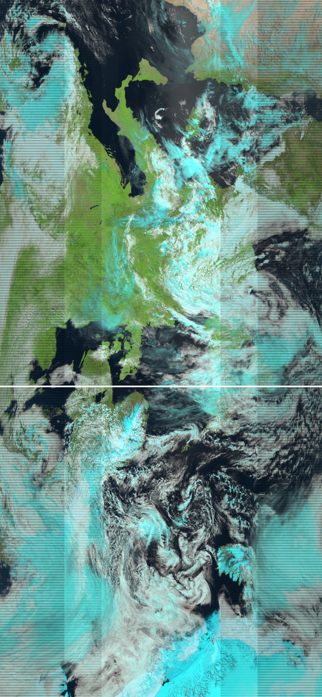
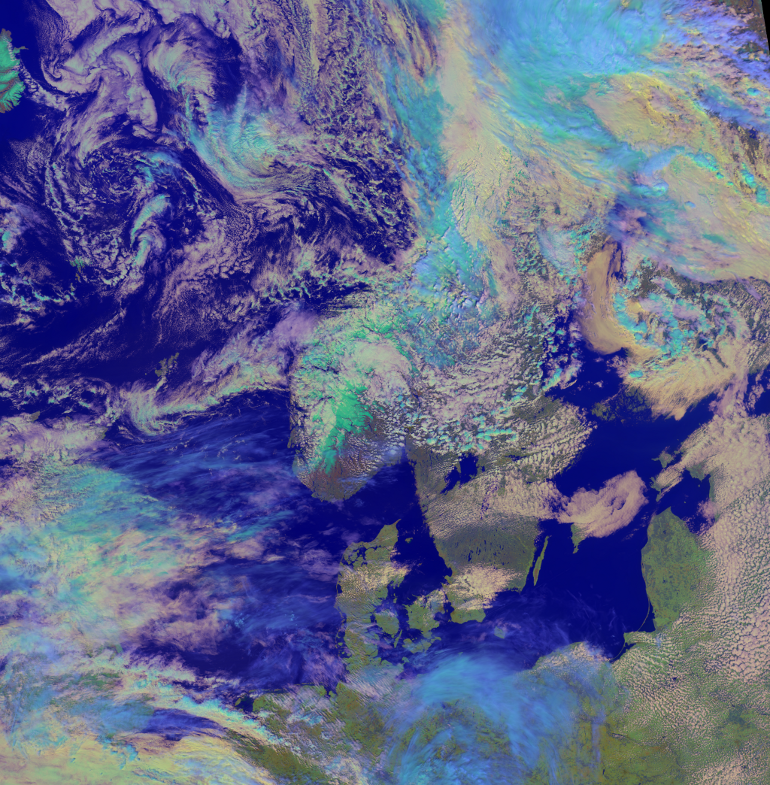
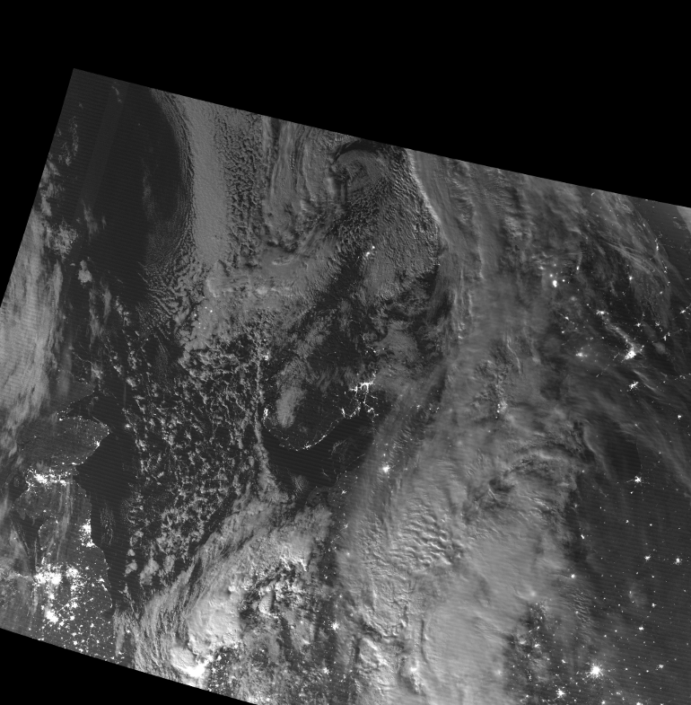

.. meta::
   :description: Reading NPP VIIRS SDR files with python
   :keywords: VIIRS, NPP, SDR, reader, read, reading, python, pytroll

==================
VIIRS with Pytroll
==================
The NOAA/NASA weather satellite Suomi National Polar Partnership (NPP) satellite was 
successfully launched October 28th, 2011. 

Suomi NPP carries the Visible Infrared Imaging Radiometer Suite (VIIRS) which
is a moderate resolution Imager with herritage from MODIS onboard the EOS
satellites Aqua and Terra, the AVHRR onboard the NOAA and Metop platforms, and
the OLS onboard the DMSP satellites. VIIRS has a nearly constant spatial
resolution across a very large swath (width is around 3000km).

In preparation for VIIRS we made a plugin reader and custom compositer to
mpop_. This was tested on synthetic (sample) data prior to launch, allowing us
to produce VIIRS imagery as soon as Direct Readout was turned on.

The example images below have been generated from direct readout data from the
station in Norrköping. We have been using the Community Satellite Processing
Package (CSPP) to go from RDR to SDR - see cspp_

For this tutorial template config files (see :doc:`install`) can be used.
These are located in the *etc* dir of the mpop_ source. Copy
*mpop.cfg.template*, *areas.def.template* and *npp.cfg.template* to another dir
and remove the *.template* extension. In the config file *npp.cfg* locate the
section :attr:`viirs-level2` and modify the defined :attr:`dir` to point to the
directory where you keep the SDR data.

Set PPP_CONFIG_DIR to the directory containing your modified mpop_ config files.

Loading
=======

    >>> from mpop.satellites import PolarFactory
    >>> from datetime import datetime
    >>> time_slot = datetime(2012, 5, 18, 12, 9)
    >>> orbit = "02882"
    >>> global_data = PolarFactory.create_scene("npp", "", "viirs", time_slot, orbit)
    >>> global_data.load([8.6])
    >>> print global_data
     -------> print(global_data)
    'M01: (0.402,0.412,0.422)μm, resolution 742m, not loaded'
    'M02: (0.436,0.445,0.454)μm, resolution 742m, not loaded'
    'M03: (0.478,0.488,0.498)μm, resolution 742m, not loaded'
    'M04: (0.545,0.555,0.565)μm, resolution 742m, not loaded'
    'M05: (0.662,0.672,0.682)μm, resolution 742m, not loaded'
    'M06: (0.739,0.746,0.754)μm, resolution 742m, not loaded'
    'M07: (0.846,0.865,0.885)μm, resolution 742m, not loaded'
    'M08: (1.230,1.240,1.250)μm, resolution 742m, not loaded'
    'M09: (1.371,1.378,1.386)μm, resolution 742m, not loaded'
    'M10: (1.580,1.610,1.640)μm, resolution 742m, not loaded'
    'M11: (2.225,2.250,2.275)μm, resolution 742m, not loaded'
    'M12: (3.610,3.700,3.790)μm, resolution 742m, not loaded'
    'M13: (3.973,4.050,4.128)μm, resolution 742m, not loaded'
    'M14: (8.400,8.550,8.700)μm, shape (768, 3200), resolution 742m'
    'M15: (10.263,10.763,11.263)μm, resolution 742m, not loaded'
    'M16: (11.538,12.013,12.489)μm, resolution 742m, not loaded'
    'I01: (0.600,0.640,0.680)μm, resolution 371m, not loaded'
    'I02: (0.845,0.865,0.884)μm, resolution 371m, not loaded'
    'I03: (1.580,1.610,1.640)μm, resolution 371m, not loaded'
    'I04: (3.580,3.740,3.900)μm, resolution 371m, not loaded'
    'I05: (10.500,11.450,12.300)μm, resolution 371m, not loaded'
    'DNB: (0.500,0.700,0.900)μm, resolution 742m, not loaded'

We have now loaded the VIIRS M14 band. Now let us look at the data:
 
    >>> global_data[8.6].show()

.. image:: images/viirs_tb86.png

The black stripes are due to the so called *bowtie deletion*, which is handled
onboard the satellite. The *bowtie* effect is a geometric feature of the VIIRS
scan. Similar to the MODIS sensor individual VIIRS lines will overlap as one
approach the edge of the swath.  These overlapping samples/pixels have been
removed onboard in order to minimise the bandwidth usage on the broadcast. Thus
when data are displayed un-projected these no-data lines will appear in the
image.

Making RGB's
============

Here is an example making a true color RGB with the VIIRS bands:

    >>> global_data.load(global_data.image.truecolor.prerequisites)
    >>> img = global_data.image.truecolor()
    >>> img.save("./viirs_truecolor.png")

.. image:: images/viirs_truecolor.png

Map projection
==============

Reprojecting data is done in exactly the same way the AVHRR data was reprojected in 
the :doc:`quickstart_avhrr` tutorial:

    >>> local_data = global_data.project("scan500m", mode="nearest")
    >>> img = local_data.image.truecolor()
    >>> img.save('./viirs_truecolor_proj.png')

Here we have defined an area called *area500m* covering Scandinavia, and with a
pixel resolution of 500 meters. This definition is stored in the
*areas.def.template* file. See the :doc:`quickstart_avhrr` tutorial.

It is easier to navigate in the image if we add coastlines and poltical
boarders, so lets do that with PIL and pycoast_:

    >>> from PIL import Image
    >>> from pycoast import ContourWriter
    >>> from mpop.projector import get_area_def
    >>> cw = ContourWriter('/local_disk/data/shapes')
    >>> img = Image.open('./viirs_truecolor_proj.png')
    >>> area_def = get_area_def("scan500m")
    >>> cw.add_coastlines(img, area_def, resolution='i', level=3)
    >>> img.save('./viirs_truecolor_proj_with_overlay.png')

But what we actually wanted was to load all the available data (VIIRS granules)
received that covers the area. To do this in a smart and economical way we only
load the granules that are inside the area of interest. But to do this we need
functionality provided by pyorbital_ and pyresample_. We leave this for an
other time, and instead we just load the granules we have and assemble them to
a full swath that we can project:

    >>> from mpop.satellites import PolarFactory
    >>> import mpop.scene
    >>> from datetime import datetime, timedelta
    >>> tstep = timedelta(seconds=60) # granules are 85 seconds long
    >>> start_time = datetime(2012, 5, 18, 11, 55) # Approximate start time
    >>> end_time = start_time + timedelta(seconds=1200) # 20 minutes for the swath to be on the safe side...
    >>> orbit = "02882"
    >>> areaid = 'scan500m'
    >>> global_data = []
    >>> tslot = start_time
    >>> while tslot < end_time:
    ...     global_data.append(PolarFactory.create_scene("npp", "", "viirs", tslot, orbit))
    ...     tslot = tslot + tstep
    >>> gldata = []
    >>> for glbd in global_data:
    ...     try:
    ...         glbd.load(glbd.image.green_snow.prerequisites |
    ...                   glbd.image.natural.prerequisites
    ...                   )
    ...         gldata.append(glbd)
    ...     except IOError:
    ...         pass
    >>> for glbd in gldata:
    ...     glbd.area = glbd['M16'].area
    >>> glb_data = mpop.scene.assemble_segments(gldata)
    >>> img = glb_data.image.natural()
    >>> img.show()

And now lets project it to the area:

    >>> local_data = glb_data.project(areaid, mode="nearest", radius=2000)

We can display the *green_snow* composite as we already made sure to load the
necessary channels earlier (see code above):

    >>> img = local_data.image.green_snow()
    >>> img.show()

High resolution images
======================

The VIIRS sensor have 5 AVHRR-like channels with a resolution 3 times higher or
even better (at edge of swath). These are the I-bands seen in the list
above. Making imagery from these goes exactly the same way as for the
M-bands. However, since there is overlap in the spectral range between I-bands
and M-bands, you need to specify also the resolution or use the band name when
loading:

    >>> global_data.load(['I03'])
    >>> global_data['I03'].show()

.. image:: images/viirs_i03.png

Generating and mapping the overview of the I-bands is done in the same way as
for the M-bands of course.  Here we have made a specific I-band overview method
called *hr_overview*:

    >>> from mpop.satellites import PolarFactory
    >>> from datetime import datetime
    >>> time_slot = datetime(2012, 5, 18, 12, 9)
    >>> orbit = "02882"
    >>> global_data = PolarFactory.create_scene("npp", "", "viirs", time_slot, orbit)
    >>> global_data.load(global_data.image.hr_overview.prerequisites)
    >>> local_data = global_data.project("scan500m", mode="nearest")
    >>> img = local_data.image.hr_overview()
    >>> img.show()

.. image:: images/viirs_hr_overview_proj.png

The Day/Night Band
==================

The VIIRS Day/Night band draws heritage from the DMSP Operational Linescan
System (OLS) and is a broad band channel in the Visible and Near-Infrared
spectral range. It operates with three different gains to optimise the
sensitivity independant of illumination. We find a nighttime case with some
moonlight, and make a stretched black and white image for display:

    >>> time_slot = datetime(2012, 8, 31, 1, 8)
    >>> orbit = "04365"
    >>> global_data = PolarFactory.create_scene("npp", "", "viirs", time_slot, orbit)
    >>> global_data.load(['DNB'])
    >>> from mpop.imageo import geo_image
    >>> img =  geo_image.GeoImage(global_data['DNB'].data, 
    ...                           None, time_slot,
    ...                           fill_value=None, mode='L')
    >>> img.enhance(stretch='linear')
    >>> img.show()

.. image:: images/npp_20120831_0108_04365_dnb_linear.png

During nighttime it is sufficiently sensitive so that useful information on
clouds and surfaces may be deduced from reflected moonlight. Naturally the
units of this band cannot be given as a solar reflectance factor, but instead
the radiance is provided:

    >>> print global_data['DNB'].info
        {'units': 'W sr-1 m-2', 'band_id': 'DNB'}

The units in the HDF5 SDR file is W/(sr*cm²) (see table 2.18.2-1, page 355 of
the NPOESS Common Data Format Control Book - Volume III - D34862-03 Rev E CDRL
No. A014). But in pytroll we keep to the physical units dictated by the netCDF
`CF convention`_ on metadata, which is W/(sr*m²).

Observe that this is really the spectral radiance *integrated* over the entire
band of wavelengths from 500 to 900 nm, and *not* a spectral radiance
(e.g. unit W/(sr*m²*μm) which is otherwise common for narrow band channels.

    >>> print global_data['DNB'].data
    [[-- 0.000143815428601 0.000137543844176 ..., 5.96219324507e-05
      6.98243966326e-05 6.63427781546e-05]
    [-- 0.00012907088967 0.000129589330754 ..., 6.90672313794e-05
      7.38868257031e-05 6.24534804956e-05]
    [-- 0.000128909057821 0.000106329993287 ..., 5.41356857866e-05
      5.57483508601e-05 6.56180200167e-05]
    ..., 
    [-- 0.000109558059194 0.00010228647443 ..., 5.17666267115e-05
      5.57982966711e-05 6.32165756542e-05]
    [-- 8.80592560861e-05 7.66862649471e-05 ..., 5.8231256844e-05
      5.83717919653e-05 5.45613984286e-05]
    [-- 7.60749680921e-05 7.15407004463e-05 ..., 6.299688539e-05
      5.79845655011e-05 6.03307526035e-05]]

We can check the range of radiaces in the granule and in print it in the units
given in the input file if we like:

    >>> print (global_data['DNB'].data * 10000).min()
    0.257498
    >>> print (global_data['DNB'].data * 10000).max()
    1928.75

Let us load a few granules and assemble them and reproject them to get an image
covering Scandinavia:

    >>> tslots = [datetime(2012, 8, 31, 1, 5), 
    ...           datetime(2012, 8, 31, 1, 7), 
    ...           datetime(2012, 8, 31, 1, 8)]
    >>> global_data = []
    >>> for time_slot in tslots:
    ...     global_data.append(PolarFactory.create_scene("npp", "", "viirs", time_slot, orbit))
    >>> for glbd in global_data:
    ...     glbd.load(['DNB'])
    ...     glbd.area = glbd['DNB'].area
    >>> global_data = mpop.scene.assemble_segments(global_data)
    >>> local_data = global_data.project(areaid, mode="nearest", radius=2000)
    >>> from mpop.imageo import geo_image
    >>> img =  geo_image.GeoImage(local_data['DNB'].data, 
    ...                           areaid, tslots[0],
    ...                           fill_value=0, mode='L')
    >>> img.enhance(stretch='linear')
    >>> img.show()

.. _`CF convention`: http://cf-pcmdi.llnl.gov/
.. _`NPP sample`: http://npp.gsfc.nasa.gov/NPP_NCT4_SAMPLE_PRODUCTS.zip
.. _mpop: http://www.github.com/mraspaud/mpop
.. _cspp: http://cimss.ssec.wisc.edu/cspp
.. _pycoast: http://pycoast.googlecode.com
.. _pyresample: http://pyresample.googlecode.com
.. _pyorbital: http://www.github.com/mraspaud/pyorbital
