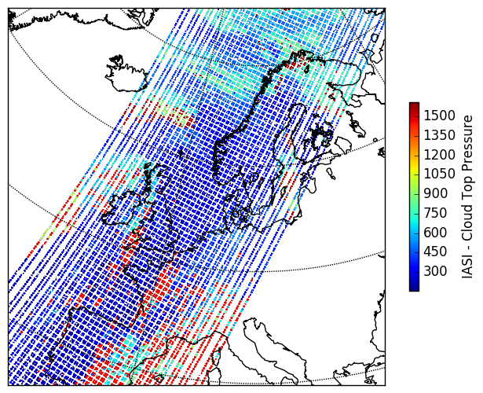

Plot IASI CTP from BUFR with *trollbufr*
========================================

Required Imports for *trollbufr*:

	>>> from trollbufr.bufr import Bufr
	>>> from trollbufr import load_file
	>>> import numpy as np
	>>> TESTFILE = 'TestBulletin_468'
	>>> PNGFILE = 'metopa_iasi_ctp_%s.png'
	>>> AREA = 'euro'

Read the test-file and decode all BUFR: 

	>>> lon = []
	>>> lat = []
	>>> pres = []
	>>> bfr = Bufr("bufrdc", ".")
	>>> for blob, size, header in load_file.next_bufr(TESTFILE):
	>>>     bfr.decode(blob)
	>>>     for subset in bfr.next_subset():
	>>>         gotit = 0
	>>>         for k, m, (v, q) in subset.next_data():
	>>>             if not gotit:
	>>>                 if k == 5001:
	>>>                     lat.append((0, 0, v))
	>>>                 if k == 6001:
	>>>                     lon.append((0, 0, v))
	>>>                 if k == 7004:
	>>>                     pres.append((0, 0, v))
	>>>                     gotit = 1 # stop at first pressure value

Transfer the value arrays into numpy arrays:

	>>> lons = np.concatenate(lon)
	>>> lats = np.concatenate(lat)
	>>> pres = np.concatenate(pres) / 100.0 # hPa
	>>> pres = np.ma.masked_greater(pres, 1.0e+6)

Resample and plot:

	>>> import pyresample as pr
	>>> from pyresample import kd_tree, geometry
	>>> from pyresample import utils
	>>> swath_def = geometry.SwathDefinition(lons=lons, lats=lats)
	>>> area_def = utils.parse_area_file('region_config.cfg', AREA)[0]
	>>> result = kd_tree.resample_nearest(swath_def, pres, area_def,
	>>>                radius_of_influence=12000, epsilon=100, fill_value=None)
	>>> pr.plot.save_quicklook(PNGFILE % AREA, area_def, result, 
	>>>                       label='IASI - Cloud Top Pressure', coast_res='l')

Full files to recreate
----------------------
 - `Source code`_ for this example.

 - A `tar.gz container`_ with the BUFR file and the required set of BUFR-tables.

.. _`Source code`: trollbufr_iasi_plot.py
.. _`tar.gz container`: _static/iasi_ctp.tgz
.. _mpop: http://www.github.com/mraspaud/mpop

